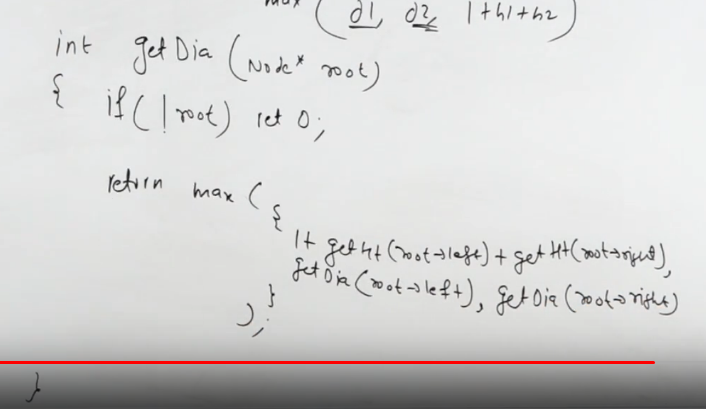
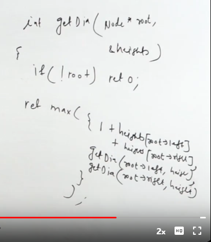
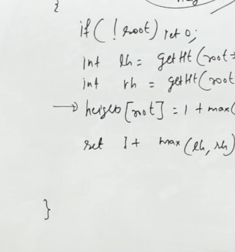
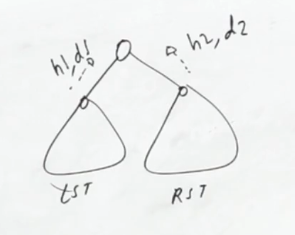
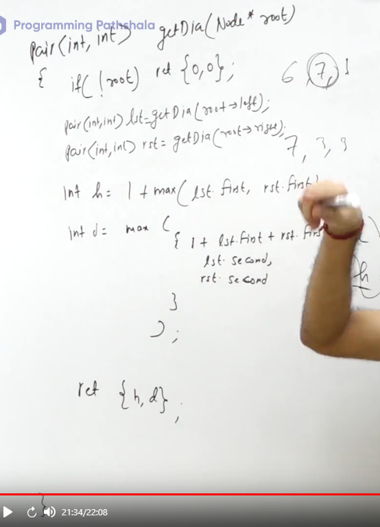

[leetcode.com](https://leetcode.com/problems/diameter-of-binary-tree/description/)

0. The biggest distance between any two nodes
1. Will always be between two leaves
2. Even in skew tree, where the definition of a leaf node is a node having only one node


# Method 1
1. Max of 1+h1+h2 at all the nodes
2. Explanation: h1 is the biggest distance from that node till the end leaf node of that subtree
3. Diameter has to pass through one of the nodes


```cpp
    int findHeight(TreeNode* root, int &maxNoOfNodes){
        if(!root) return 0;
        int h1=findHeight(root->left,maxNoOfNodes), h2=findHeight(root->right,maxNoOfNodes);
        maxNoOfNodes=max(maxNoOfNodes,1+h1+h2);
        return 1+max(h1,h2);
    }


    int diameterOfBinaryTree(TreeNode* root) {
        if(!root) return 0;
        int maxNoOfNodes=1;
        findHeight(root,maxNoOfNodes);
        return maxNoOfNodes-1;
    }
```


# Method 2




# Optimization



# Method 3


