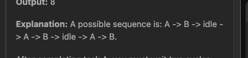
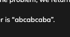

yashesh pigeonhole principal
[Coding Ninjas Studio](https://www.codingninjas.com/studio/problems/ninja-and-rearrange-string_1461424)

# Separate defnition
for n=2 leetcode mean


Coding ninja mean

see last 2 a


```cpp
#include <bits/stdc++.h> 
bool rearrangeString(string &s, int n){
        n--;
        vector<int> cnt(26,0);
        for(char &c:s) cnt[c-'a']++;
        priority_queue<int> pq;
        for(int &x:cnt) if(x) pq.push(x);
        int ans=0;
        while(!pq.empty()){
            int interval=n+1;
            vector<int> temp;
            while(interval--){
                if(pq.empty()){
                    if(!temp.empty()) ans+=(interval+1);
                    //so actually decreased interval
                    //one more time while entering this loop
                    //which should not happen
                    break;
                }
                int x=pq.top();
                pq.pop();
                if(x-1>0) temp.push_back(x-1);
                ans++; 
            }
            for(int &y:temp) pq.push(y);
        }
        return ans==s.size();
}

```
