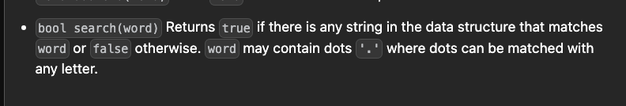

# Trie except



[Design Add and Search Words Data Structure - LeetCode](https://leetcode.com/problems/design-add-and-search-words-data-structure/description/)

```cpp
    int searchUtil(string &word, int idx, TrieNode* node){
        if(!node) return 0;
        if(idx==word.size()) return node->noOfTimesPresent;
        char c=word[idx];
        if(c=='.'){
            for(int i=0;i<26;i++){
                if(node->children[i]){
                    if(searchUtil(word, idx+1, node->children[i])){
                        return 1;
                    }
                }
            }
            return 0;
        }

        return searchUtil(word,idx+1,node->children[word[idx]-'a']);
    }

    int custom_search(string word) {
        return searchUtil(word,0,root);
    }
};


class WordDictionary {
    Trie t;
    public:
    WordDictionary() {
    }
    
    void addWord(string word) {
        t.insert(word);
    }
    
    bool search(string word) {
        return t.custom_search(word);
    }
};

```


```CPP
class Trie{
    private:
        struct TrieNode{
            TrieNode* children[26];
            int noOfTimesPresent;
            int strings; 

            TrieNode(){
                noOfTimesPresent = 0;
                strings = 0;
                for(int i = 0; i < 26; i++) {
                    children[i] = nullptr;
                }
            }
        };

        TrieNode* root=nullptr;

    public:

    Trie(){
        root = new TrieNode();
    }

    ~Trie() {
            // for (int i = 0; i < 26; i++) {
            //     delete children[i];
            // }
        delete root;
    }
/*******************************************************************************************/

    void insertUtil(TrieNode* node, string &word, int idx){
        node->strings++;
        if(idx==word.size()){
            node->noOfTimesPresent++;
            return;
        }
        int childIdx=word[idx]-'a';
        if(!node->children[childIdx]){
            node->children[childIdx]= new TrieNode();;
        }
        node=node->children[childIdx];        
        insertUtil(node,word,idx+1);   
    }

    void insert(string &word){
        insertUtil(root,word,0);
    }

/*******************************************************************************************/

    int searchUtil(string &word, int idx, TrieNode* node){
        if(!node) return 0;
        if(idx==word.size()) return node->noOfTimesPresent;
        char c=word[idx];
        if(c=='.'){
            for(int i=0;i<26;i++){
                if(node->children[i]){
                    if(searchUtil(word, idx+1, node->children[i])){
                        return 1;
                    }
                }
            }
            return 0;
        }

        return searchUtil(word,idx+1,node->children[word[idx]-'a']);
    }

    int custom_search(string word) {
        return searchUtil(word,0,root);
    }

/*******************************************************************************************/


    // int startsWithUtil(string &prefix, int idx, TrieNode* node){
    //     if(!node) return 0;
    //     if(idx==prefix.size()) return node->strings;
    //     return startsWithUtil(prefix,idx+1,node->children[prefix[idx]-'a']);
    // }

    // int startsWith(string prefix) {
    //     return startsWithUtil(prefix,0,root);
    // }


/*******************************************************************************************/

    // void eraseUtil(string &word, int idx, TrieNode* node){
    //     node->strings--;
    //     if(idx==word.size()){
    //         node->noOfTimesPresent--;
    //         return;
    //     }
    //     eraseUtil(word,idx+1,node->children[word[idx]-'a']);
    // }


    // void erase(string &word){
    //     if(search(word)){
    //         eraseUtil(word,0,root);
    //     }
    // }

/*******************************************************************************************/

};


class WordDictionary {

    Trie t= Trie();
    public:
    WordDictionary() {
    }
    
    void addWord(string word) {
        t.insert(word);
    }
    
    bool search(string word) {
        return t.custom_search(word);
    }
};

/**
 * Your WordDictionary object will be instantiated and called as such:
 * WordDictionary* obj = new WordDictionary();
 * obj->addWord(word);
 * bool param_2 = obj->search(word);
 */
```
