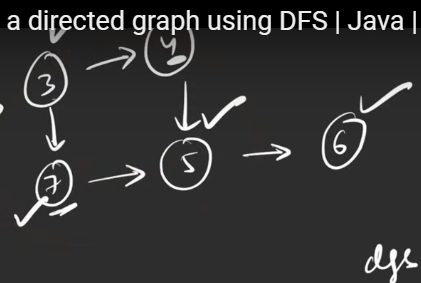
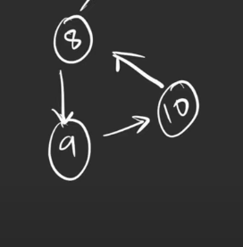

[Detect cycle in a directed graph | Practice | GeeksforGeeks ](https://practice.geeksforgeeks.org/problems/detect-cycle-in-a-directed-graph/1)

The undirected code will not work for this function signature
```cpp
bool isCyclic(int n, vector<int> al[])
```
Why it does not work?

The above algorithm will conclude this as cycle when it is not



On the continous path you have to visit the node again


# concept of visited and path visited array

[youtu.be](https://youtu.be/9twcmtQj4DU?si=PWEqZ5NCVQA9urrT)

```cpp
bool dfs(int node, vector<bool> &vis, vector<bool> & pathVis, vector<int> al[]){
    vis[node]=1;
    pathVis[node]=1;
    
    for(int nei: al[node]){
        if(!vis[nei]){
            if(dfs(nei,vis,pathVis,al)==1) return 1;
        }
        // it means vis[nei]==1 then only it come here
        else if(pathVis[nei]) return 1;
    }
    
    pathVis[node]=0;
    return 0;
}


bool isCyclic(int n, vector<int> al[]) {
    vector<bool> vis(n,0),pathVis(n,0);
    for(int i=0;i<n;i++){
        if(dfs(i,vis,pathVis,al)==1) return 1;
    }
    return 0;
}
```
