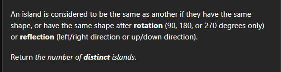

Premium problem
[Number of Distinct Islands II - LeetCode](https://leetcode.com/problems/number-of-distinct-islands-ii/description/)

he 8 rotations and reflections of each point are 
`(x, y), (-x, y), (x, -y), (-x, -y) `
`(y, x), (-y, x), (y, -x), (-y, -x)`

[algo.monster](https://algo.monster/liteproblems/711)