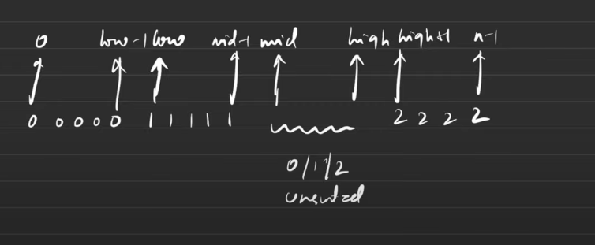
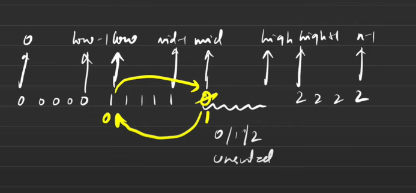

:rainbow_flag:
[leetcode.com](https://leetcode.com/problems/sort-colors/)

0 to l-1 => 0
l to m-1 =>1
m to h => unsorted
h+1 to n-1 => 2

initially
l=0
m=0
h=n-1






```cpp
int l=0,m=0,h=n-1;
while(m<=h){
    if(v[m]==0) swap(v[l++],v[m++]);
    else if(v[m]==1) m++;
    else swap(v[m],v[h--]);
}
```

[Sort an array of 0's 1's & 2's | Intuition of Algo🔥 | C++ Java Python | Brute-Better-Optimal - YouTube](https://youtu.be/tp8JIuCXBaU?si=Nh_-8Nb0BBbzSeWI)

[Bucket sort](https://my.supernotes.app/?preview=a27cf891-f5fc-429e-b659-8ec1029c9ee5)
