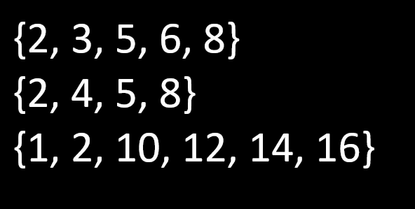
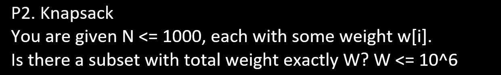

[C++ Bitsets in Competitive Programming - YouTube](https://youtu.be/jqJ5s077OKo?si=YXGF3n3yent_wPb9)

[Bitwise operations 2 — popcount & bitsets - Codeforces](https://codeforces.com/blog/entry/73558)

