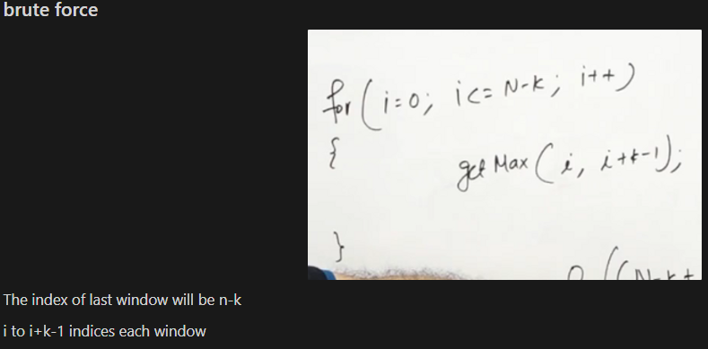
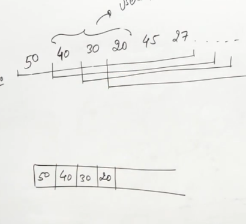
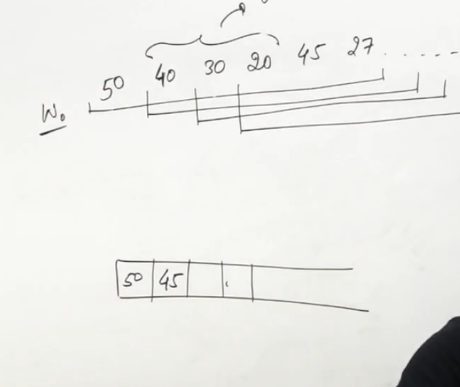
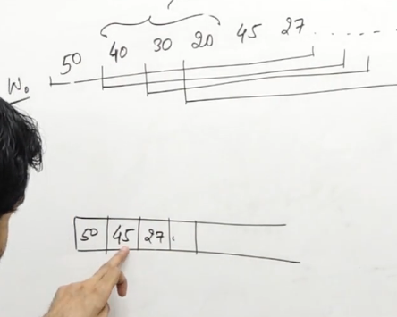
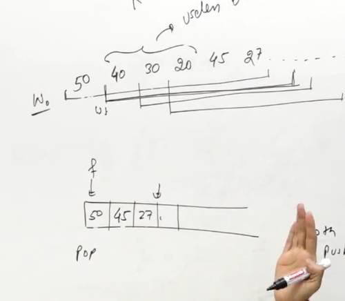

[leetcode.com](https://leetcode.com/problems/sliding-window-maximum/)
1. General knowledge


# Sliding window with the help of decreasing multiset
```cpp
  vector<int> maxSlidingWindow(vector<int>& v, int k) {
      int n=v.size();
      multiset<int,greater<int>> se;
      vector<int> ans;
      for(int i=0;i<=k-2;i++) se.insert(v[i]);
      for(int i=k-1;i<n;i++){
          se.insert(v[i]);
          ans.push_back(*se.begin());
          se.erase(se.find(v[i-k+1]));
      }
      return ans;
  }
```

# Monotonic Queue
# The above was monotonic deceasing Queue, which give maxima, montonic increasing queue will give minima at front









```cpp
//insertBack only insert the usefull elements
void insertBack(deque<int> &d, int idx,  vector<int>& v){
    while(!d.empty() and v[idx]>=v[d.back()]) d.pop_back();
    d.push_back(idx);
}
```

```cpp
vector<int> maxSlidingWindow(vector<int>& v, int k) {
    vector<int> ans;
    deque<int> d;
    int n=v.size();
    for(int i=0;i<=k-2;i++) insertBack(d,i,v);
    for(int i=k-1;i<n;i++){
        insertBack(d,i,v);
        ans.push_back(v[d.front()]);
        if(d.front()==i-k+1) d.pop_front();
    }
    return ans;
}
```

