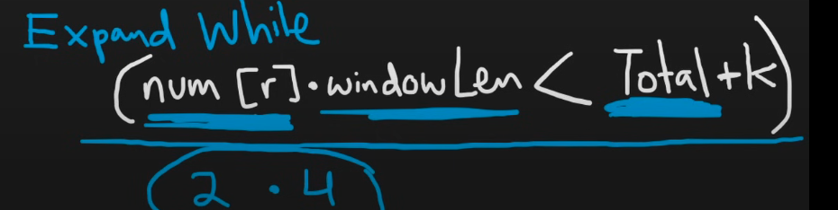

[Just a moment...](https://leetcode.com/problems/frequency-of-the-most-frequent-element/)





```cpp
int maxFrequency(vector<int>& v, int k) {
    sort(v.begin(),v.end());
    int n=v.size();
    int l=0,h=0;
    long long sum=0;
    int ans=1;
    while(h<n){
        sum+=v[h];
        while(((long long)(h-l+1)*v[h])>sum+k){
            sum-=v[l];
            l++;
        }
        ans=max(ans,h-l+1);
        h++;
    }
    return ans;
}
```
