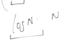
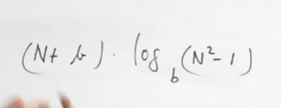
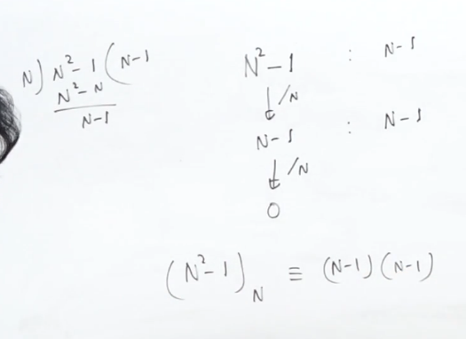
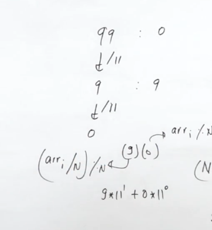
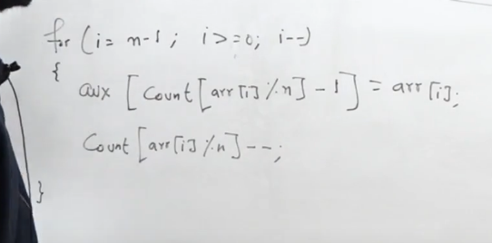
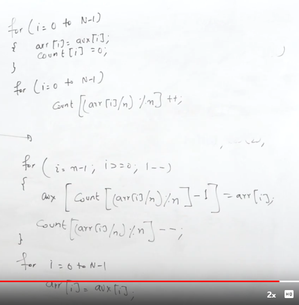

[Efficiently sorting numbers in range from 0 to n^2 - 1 | Practice | GeeksforGeeks ](https://practice.geeksforgeeks.org/problems/efficiently-sorting-number-from-0-to-n2-15444/1)


vs

 taking b=n


This is the representation of the biggest number

After proving any number can be expressed in pnly 2 digits 







```cpp
void sort(int v[], int n) {
    int b=n;
    vector<int> cnt(b,0),tmp(b);
    for(int i=0;i<n;i++) cnt[v[i]%b]++;
    for(int i=1;i<n;i++) cnt[i]+=cnt[i-1];
    for(int i=n-1;i>=0;i--){
        tmp[cnt[v[i]%b]-1]=v[i];
        cnt[v[i]%b]--;
    }
    for(int &x:cnt) x=0;
    for(int i=0;i<n;i++) cnt[(tmp[i]/b)%b]++;
    for(int i=1;i<n;i++) cnt[i]+=cnt[i-1];
    for(int i=n-1;i>=0;i--){
        v[cnt[(tmp[i]/b)%b]-1]=tmp[i];
        cnt[(tmp[i]/b)%b]--;
    }
}
```

