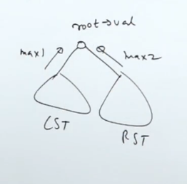

[leetcode.com](https://leetcode.com/problems/validate-binary-search-tree/description/)





```cpp
vector<long> t(TreeNode* node){
    if(!node) return {LONG_MAX,LONG_MIN,1};
    auto l=t(node->left);
    auto r=t(node->right);
    bool flag=l[2] and r[2] and node->val>l[1] and node->val<r[0];
    long minn=min({l[0],r[0],(long)node->val});
    long maxx=max({l[1],r[1],(long)node->val});
    return {minn,maxx,flag};

}

bool isValidBST(TreeNode* root) {
    return t(root)[2];
}
```
