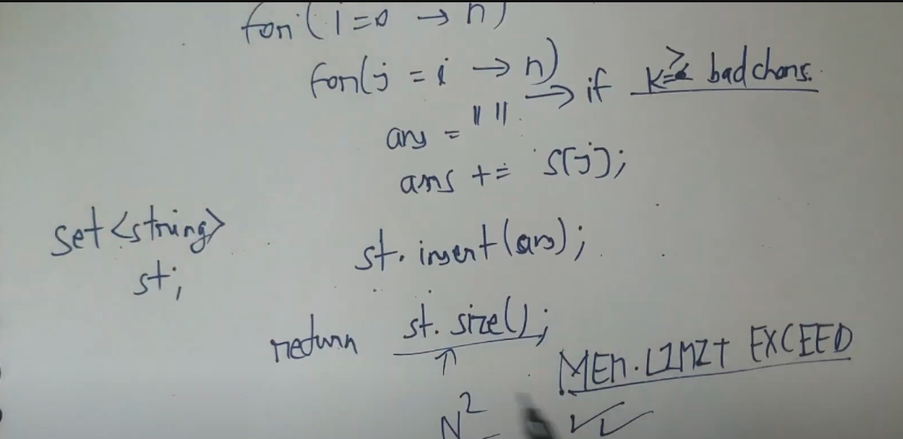

[Problem - 271D - Codeforces](https://codeforces.com/problemset/problem/271/D)

[maang.in](https://maang.in/problems/Good-Substrings-421?resourceUrl=cs84-cp498-pl3346-rs421)


# MLE

# trie
```cpp
#include <bits/stdc++.h>
using namespace std;
#include<ext/pb_ds/assoc_container.hpp>
#include<ext/pb_ds/tree_policy.hpp>
using namespace __gnu_pbds;
typedef tree<long long, null_type, less_equal<long long>, rb_tree_tag, tree_order_statistics_node_update> pbds; // find_by_order, order_of_key
#define it(v) v.begin(),v.end()
#define ll long long
#define vl vector<long long> 
#define vvl vector<vector<long long>> 
#define nl '\n'
#define lld long double
#define ull unsigned long long  
#define iinp(n) long long n; cin>>n;
#define sinp(s) string s; cin >> s ;cin.ignore();
#define vinp(name,size) vector<ll>name (size); for(int i=0;i<size;i++) {cin>>name[i];}

// template<typename... T> void pri(T&&... args){((cout << args <<" "), ...);cout<<'\n';}
// template<typename... T> void inp(T&... args){((cin >> args and cin.ignore()), ...);}

void priv(vector<ll> &v){for(int i=0;i<v.size();i++){cout<<v[i]<<" ";}cout<<'\n';}
void _pri(ll t) {cerr << t<<" ";}
void _pri(string t) {cerr << t;}
void _pri(char t) {cerr << t;}
void _pri(lld t) {cerr << t;}
void _pri(double t) {cerr << t;}
void _pri(ull t) {cerr << t;}  
 
template <class T, class V> void _pri(pair <T, V> p);
template <class T> void _pri(vector <T> v);
template <class T> void _pri(set <T> v);
template <class T, class V> void _pri(map <T, V> v);
template <class T> void _pri(multiset <T> v);
template <class T, class V> void _pri(pair <T, V> p) {_pri(p.first); cerr << " "; _pri(p.second); cerr << '\n';}
template <class T> void _pri(vector <T> v) {for (T i : v){_pri(i);}cerr <<'\n';}    
template <class T> void _pri(set <T> v) {for (T i : v) {_pri(i); } cerr << '\n';}
template <class T> void _pri(multiset <T> v) {for (T i : v) {_pri(i);} cerr << '\n';}
template <class T, class V> void _pri(map <T, V> v) {for (auto i : v) {_pri(i);} cerr <<'\n';}
#define mod 1000000007  
ll moda(ll a, ll b, ll cm=mod) {a = a % cm; b = b % cm; return (((a + b) % cm) + cm) % cm;}
ll modm(ll a, ll b, ll cm=mod) {a = a % cm; b = b % cm; return (((a * b) % cm) + cm) % cm;}
ll mods(ll a, ll b, ll cm=mod) {a = a % cm; b = b % cm; return (((a - b) % cm) + cm) % cm;}
int mpow(int base, int exp, long long cmod=mod){base %= cmod;long long result = 1;while (exp > 0) {if (exp & 1) result = ((long long)result * base) % cmod;base = ((long long)base * base) % cmod;exp >>= 1;}return result;}    
ll inv(ll a, ll m) {return mpow(a, m - 2, m);}
ll modd(ll a, ll b, ll cm=mod) {a = a % cm; b = b % cm; return (modm(a, inv(b, cm), cm) + cm) % cm;}
#define popcnt(x) __builtin_popcountll(x) 
// cout<<fixed<<setprecision(6);


#define endl '\n'

#define int ll


class Trie{
    private:
        struct TrieNode{
            TrieNode* children[26];
            int noOfTimesPresent;
            int strings;

            TrieNode(){
                noOfTimesPresent = 0;
                strings = 0;
                for(int i = 0; i < 26; i++) {
                    children[i] = nullptr;
                }
            }
        };

    TrieNode* root=nullptr;
    public:
        int noOfNodes; 

    Trie(){
        root = new TrieNode();
        noOfNodes=1;
    }

    ~Trie() {
        delete root;
    }
/*******************************************************************************************/

    void insertUtil(TrieNode* node, string &word, int idx){
        node->strings++;
        if(idx==word.size()){
            node->noOfTimesPresent++;
            return;
        }
        int childIdx=word[idx]-'a';
        if(!node->children[childIdx]){
            node->children[childIdx]= new TrieNode();
            noOfNodes++;
        }
        node=node->children[childIdx];        
        insertUtil(node,word,idx+1);   
    }

    void insert(string word){
        insertUtil(root,word,0);
    }

/*******************************************************************************************/

    int searchUtil(string &word, int idx, TrieNode* node){
        if(!node) return 0;
        if(idx==word.size()) return node->noOfTimesPresent;
        return searchUtil(word,idx+1,node->children[word[idx]-'a']);
    }

    int search(string word) {
        return searchUtil(word,0,root);
    }

/*******************************************************************************************/


    int startsWithUtil(string &prefix, int idx, TrieNode* node){
        if(!node) return 0;
        if(idx==prefix.size()) return node->strings;
        return startsWithUtil(prefix,idx+1,node->children[prefix[idx]-'a']);
    }

    int startsWith(string prefix) {
        return startsWithUtil(prefix,0,root);
    }


/*******************************************************************************************/

    void eraseUtil(string &word, int idx, TrieNode* node){
        node->strings--;
        if(idx==word.size()){
            node->noOfTimesPresent--;
            return;
        }
        eraseUtil(word,idx+1,node->children[word[idx]-'a']);
    }


    void erase(string &word){
        if(search(word)){
            eraseUtil(word,0,root);
        }
    }

/*******************************************************************************************/


int countDistinctSubstrings(string &s, string &good, ll n, ll k){
/**********************CUSTOM INSERT FOR SUBSTRINGS*****************/
/*We are not starting from root everytime */
    for(int i=0;i<n;i++){
        TrieNode* curr=root;
        ll cnt=0;
        for(int j=i;j<n;j++){
            char c=s[j];
            ll idx=c-'a';
            if(good[s[j]-'a']=='0') cnt++;
            if(cnt>k) break;
            if(!curr->children[idx]){
                curr->children[idx]= new TrieNode();
                noOfNodes++;
            }
            curr=curr->children[idx];
/******************************************************************/
        }
    }
    return noOfNodes-1;
}

};


void solve(){
    sinp(s);
    sinp(good);
    iinp(k);
    ll n=s.size();
    Trie t= Trie();
    cout<<t.countDistinctSubstrings(s,good,n,k)<<endl;
}


int32_t main(){
    ios_base::sync_with_stdio(0);cin.tie(0);cout.tie(0);
    #ifndef ONLINE_JUDGE
    freopen("/Users/tm/Developer/APRIL24/input.txt", "r", stdin);
    freopen("/Users/tm/Developer/APRIL24/output.txt", "w", stdout);
    freopen("/Users/tm/Developer/APRIL24/error.txt", "w", stderr);
    #endif

    int ttt;
    ttt=1;
    // cin>>ttt;
    int ccc=ttt;
    //precomputaion

    //precomputaion
    while(ttt--){
        // cout<<"Case "<<(ccc-ttt)<<":"<<" ";
        solve();
    } 
    // cerr<<(float)clock()/CLOCKS_PER_SEC<<" secs"<<endl;

}

```


# String algorithms
[Good Substrings- Codeforces | Rabin Karp Rolling Hash | Text Processing - YouTube](https://www.youtube.com/watch?v=pTj1QvxOzOI)

