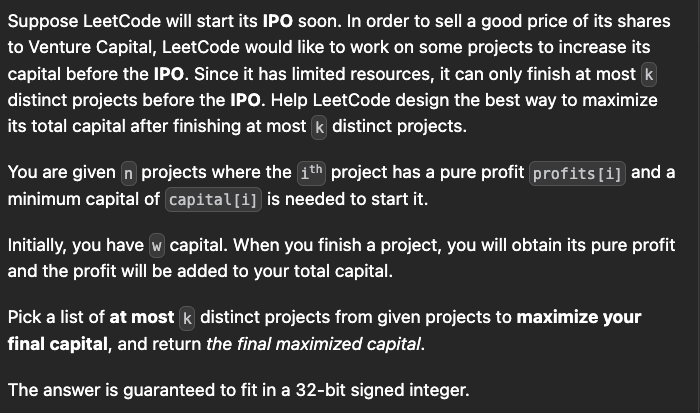

[leetcode.com](https://leetcode.com/problems/ipo/description/)

# Two heap sol available in design gurus, search on youtube

# Black Magic

```cpp
int findMaximizedCapital(int no, int startingCapital, vector<int>& p, vector<int>& c) {
    int n=p.size();
    //cost,profits: cost in increasing order
    vector<vector<int>> ma(n);
    //profits in decreasing order
    priority_queue<int> pq;
    for(int i=0;i<n;i++){
        ma[i]={c[i],p[i]};
    }
    sort(ma.begin(),ma.end(),[](auto &a, auto &b){
    return a[0]==b[0]?a[1]>b[1]:a[0]<b[0];
    });

    int idx=0; 
    while(no--){
        while(idx<n and ma[idx][0]<=startingCapital){
            pq.push(ma[idx][1]);
            idx++;
        }

        if(pq.empty()) break;

        startingCapital+=pq.top();pq.pop();
    }
    return startingCapital;
}
```

# below solutions are extinct

--------------------------------------------------------------------------------------------------
# Note this implementation is incorrect
### Wrong Answer
14 / 35 testcases passed

```cpp
int findMaximizedCapital(int no, int startingCapital, vector<int>& pro, vector<int>& cap){
    //sorted on based on capital increasind
    //priority_queue based upon pro decreasing
    int n=pro.size();
    vector<vector<int>> ma;
    for(int i=0;i<n;i++){
        ma.push_back({cap[i],pro[i]});
    }
    sort(ma.begin(),ma.end());        
    priority_queue<int> pq;
    int idx=0;
    int cnt=0;
    while((idx<n or !pq.empty()) and cnt!=no){
        if(idx<n and startingCapital<ma[idx][1]) break;
        while(idx<n and startingCapital>=ma[idx][1]){
            pq.push(ma[idx][0]);
            idx++;
        }
        if(!pq.empty()){
            int tmp=pq.top();pq.pop();
            startingCapital+=tmp;
            cnt++;
        }
    }
    return startingCapital;
}
```

# Ant this is correct

```cpp
int findMaximizedCapital(int no, int startingCapital, vector<int>& p, vector<int>& c) {
    int n=p.size();
    vector<pair<int,int>> ma;
    priority_queue<int> pq;
    for(int i=0;i<n;i++){
        ma.push_back({c[i],p[i]});
    }
    sort(ma.begin(),ma.end());
    int idx=0;
    while(idx<n){
        if(ma[idx].first<=startingCapital){
            pq.push(ma[idx].second);
        }
        else if(no && !pq.empty()){
                startingCapital+=pq.top();
                pq.pop();
                no--;
                idx--;
            }
        idx++; 
    }
    while(!pq.empty() && no){
        startingCapital+=pq.top();pq.pop();
        no--;
    }
    return startingCapital;
}
```

