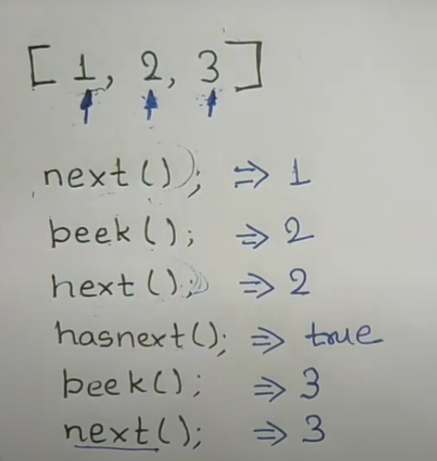

[Peeking Iterator - LeetCode](https://leetcode.com/problems/peeking-iterator/)




intially peek will give you 1

```cpp
class Iterator {
private:
    struct Data;
    Data* data;
public:
    Iterator(const vector<int>& nums);
    Iterator(const Iterator& iter);

    // Returns the next element in the iteration.
    int next();

    // Returns true if the iteration has more elements.
    bool hasNext() const;
    //"const member function". This means that the member function does not and should not modify any of the non-static data members of the class. In other words, it promises that the function will not modify the object on which it's called.
//You can call this member function on a `const` object of the class.
//Inside the body of this function, you cannot modify any non-static data members of the class (unless they are declared as `mutable`).
//For the given `Iterator` class, the `hasNext` function is marked as `const` because when you check if there are more items to iterate over, you typically don't want to modify the iterator's internal state. It's merely a check and should not have any side-effects on the object.


    
};
```

```cpp
class PeekingIterator : public Iterator {
public:
	PeekingIterator(const vector<int>& nums) : Iterator(nums) {
	    // Initialize any member here.
	    // **DO NOT** save a copy of nums and manipulate it directly.
	    // You should only use the Iterator interface methods.
//when you have a derived class (in this case, PeekingIterator) and you're defining its constructor, you often need to also explicitly call the constructor of its base class (in this case, Iterator). This is especially true if the base class doesn't have a default constructor (a constructor with no arguments) or if you need to pass specific arguments to the base class's constructor.	    
	}
	
    // Returns the next element in the iteration without advancing the iterator.
	int peek() {
        return Iterator(*this).next();
        //Iterator(*this) creates a temporary copy of the current PeekingIterator object, which is also an Iterator object due to inheritance.
// .next() is called on this temporary object. This means the next() function advances the temporary iterator and not the original one. As a result, you get the next value, but the original PeekingIterator remains unchanged
	}

};
```

