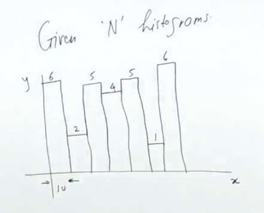

[](https://leetcode.com/problems/largest-rectangle-in-histogram/description/)




# Brute force
```cpp
int largestRectangleArea(vector<int>& v) { 
    int n=v.size(); 
    int ans=0; 
    for(int i=0;i<n;i++){ 
        //going left 
        int l,r; 
        l=i; 
        r=i; 
        while(l>=0 and v[l]>=v[i]) l--; 
        while(r<n and v[r]>=v[i]) r++; 
        ans=max(ans,v[i]*(r-l+1-2))); 
    } 
    return ans; 
     
} 
```

```cpp
vector<int> previousLess(vector<int>& v){ 
    int n=v.size();
    vector<int> nge(n,-1); 
    stack<int> st;
    st.push(n-1);
    for(int i=n-2;i>=0;i--){ 
        while(!st.empty() and v[i]<v[st.top()]){
            nge[st.top()]=i;
            st.pop();
        } 
        st.push(i);
    }
    return nge;     
}
//next lesser element  to the right    
vector<int> nextLess(vector<int>& v) { 
    int n=v.size();
    vector<int> nge(n,n); 
    stack<int> st;
    st.push(0);
    for(int i=1;i<n;i++){
        while(!st.empty() and v[i]<v[st.top()]){
            nge[st.top()]=i;
            st.pop();
        }
        st.push(i);
    }       
    return nge;     
}

int largestRectangleArea(vector<int>& v) {
    int n=v.size();
    int ans=0;
    vector<int> pl=previousLess(v); 
    vector<int> nl=nextLess(v);
    for(int i=0;i<n;i++){
        int l=pl[i];
        int r=nl[i];
        ans=max(ans,v[i]*(r-l+1-2));
    }
    return ans; 
}
```
