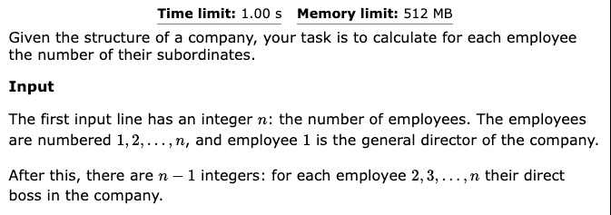

parent of root is -1, if it is explicityly stated a node is a root node

for leaf noOfNei[leaf]==1

```cpp
void dfs(ll node, vvl &al, ll par, vl &levels, vl &parents, ll level, vl &subTrees){
    levels[node]=level;
    parents[node]=par;
    for(ll nei: al[node]){
        if(nei==par) continue;
        dfs(nei,al,node,levels,parents,level+1,subTrees);
        subTrees[node]+=subTrees[nei];
    }
    subTrees[node]++;
}
```

```cpp
vvl al(n,vl());
```

1. al.size() is the no. of neigbours of i

--------------------------------------------------------------------------------------------------


# No. of subordinates
[CSES - Subordinates](https://cses.fi/problemset/task/1674/)



```cpp
void dfs(ll node, ll par, vl &dp, vvl &al){
    for(ll nei: al[node]){
        if(nei!=par){
            dfs(nei,node,dp,al);
            dp[node]+=dp[nei];
        }
    }
    dp[node]++;
} 
 
 
void solve(){   
    iinp(n);
    vvl al(n,vl());
    for(ll i=1;i<n;i++){
        iinp(tmp);
        tmp--;  
        al[i].push_back(tmp);
        al[tmp].push_back(i);
    }
    vl dp(n,0);
    dfs(0,-1,dp,al);
    for(ll i=0;i<n;i++){
        cout<<dp[i]-1<<" ";
    }
    pri();
    
}
```