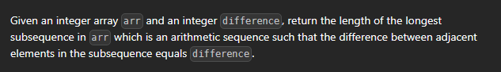

[leetcode.com](https://leetcode.com/problems/longest-arithmetic-subsequence-of-given-difference/description/?envType=study-plan-v2&envId=dynamic-programming)




```cpp
int longestSubsequence(vector<int>& v, int d) {
    int n=v.size();
    int ans=1;
    unordered_map<int,int> dp;
    //this is just acting like dp array
  
    for(int x: v){
        if(dp.count(x-d)) dp[x]=1+dp[x-d];
        else dp[x]=1;
        ans=max(ans,dp[x]);
    }
    return ans;
}
```

------------------------------------------------------------------------------------------------------------------
the most recent ones will be automatically be filled with maximum value, because it will be more for sure, suppose 5................5 , 