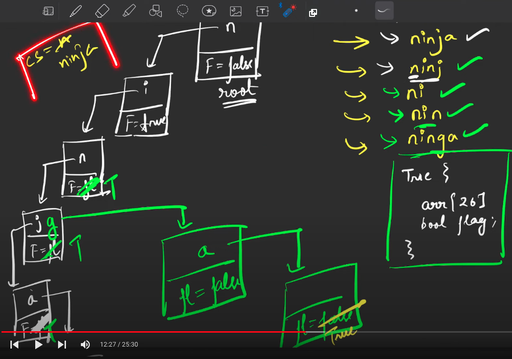

[Code 360 by Coding Ninjas](https://www.naukri.com/code360/problems/complete-string_2687860?utm_source=youtube&utm_medium=affiliate&utm_campaign=striver_tries_videos)


```cpp
bool dfs(string s){
    TrieNode *node = root;
    for (char c : s){
        if (!node->children[c - 'a'] || node->children[c - 'a']->noOfTimesPresent == 0){
            return 0;
        }
        node = node->children[c - 'a'];
    }
    return 1;
}
```

```cpp
#include <bits/stdc++.h> 

class Trie{
    private:
        struct TrieNode{
            TrieNode* children[26];
            int noOfTimesPresent;
            int strings; 

            TrieNode(){
                noOfTimesPresent = 0;
                strings = 0;
                for(int i = 0; i < 26; i++) {
                    children[i] = nullptr;
                }
            }
        };

        TrieNode* root=nullptr;

    public:

    Trie(){
        root = new TrieNode();
    }

    ~Trie() {
        delete root;
    }
/*******************************************************************************************/

    void insertUtil(TrieNode* node, string &word, int idx){
        node->strings++;
        if(idx==word.size()){
            node->noOfTimesPresent++;
            return;
        }
        int childIdx=word[idx]-'a';
        if(!node->children[childIdx]){
            node->children[childIdx]= new TrieNode();;
        }
        node=node->children[childIdx];        
        insertUtil(node,word,idx+1);   
    }

    void insert(string &word){
        insertUtil(root,word,0);
    }

/*******************************************************************************************/

    int searchUtil(string &word, int idx, TrieNode* node){
        if(!node) return 0;
        if(idx==word.size()) return node->noOfTimesPresent;
        return searchUtil(word,idx+1,node->children[word[idx]-'a']);
    }

    int search(string word) {
        return searchUtil(word,0,root);
    }

/*******************************************************************************************/


    int startsWithUtil(string &prefix, int idx, TrieNode* node){
        if(!node) return 0;
        if(idx==prefix.size()) return node->strings;
        return startsWithUtil(prefix,idx+1,node->children[prefix[idx]-'a']);
    }

    int startsWith(string prefix) {
        return startsWithUtil(prefix,0,root);
    }


/*******************************************************************************************/

    void eraseUtil(string &word, int idx, TrieNode* node){
        node->strings--;
        if(idx==word.size()){
            node->noOfTimesPresent--;
            return;
        }
        eraseUtil(word,idx+1,node->children[word[idx]-'a']);
    }


    void erase(string &word){
        if(search(word)){
            eraseUtil(word,0,root);
        }
    }

/*******************************************************************************************/


};


string completeString(int n, vector<string> &vos){
    Trie t= Trie();
    for(auto s: vos) t.insert(s);
    string ans = "";
    for(auto s: vos){
        if (!t.dfs(s)) {
              continue;
        }
        if(s.size()>ans.size() or (s.size()==ans.size() and s<ans)){
            ans=s;
        }

    }
    if(ans.size() == 0) return "None";
    return ans;
}
```
