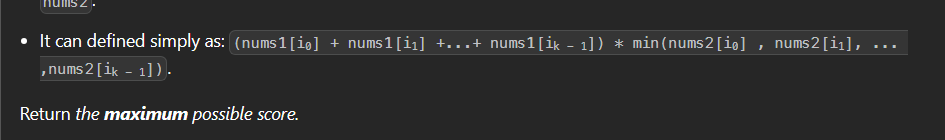
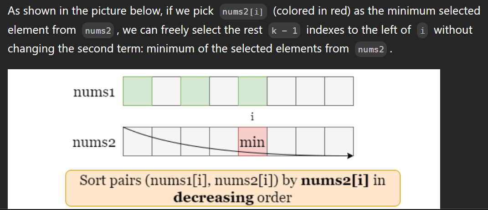
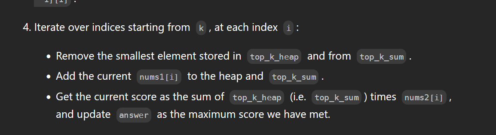

[Maximum Subsequence Score - LeetCode](https://leetcode.com/problems/maximum-subsequence-score/description/)

1. choose k elements from v1
2. corresponding k elemnts from v2
3. 


1. All elements are positive
2. 

```cpp
long long maxScore(vector<int>& v1, vector<int>& v2, int k) {
    int n=v1.size();
    vector<vector<int>> v;
    for(int i=0;i<n;i++){
        v.push_back({v2[i],v1[i]});
    }
    sort(v.begin(),v.end(),greater<vector<int>>());
    long long ans=LLONG_MIN,sum=0;
    priority_queue<int,vector<int>,greater<int>> pq;

    //k-1 elements
    for(int i=0;i<=k-2;i++){
        sum+=v[i][1];
        pq.push(v[i][1]);
    }


    for(int i=k-1;i<n;i++){
        sum+=v[i][1];
        pq.push(v[i][1]);
        ans=max(ans,sum*v[i][0]);
        sum-=pq.top();
        pq.pop();
    }
    return ans;
}
```


