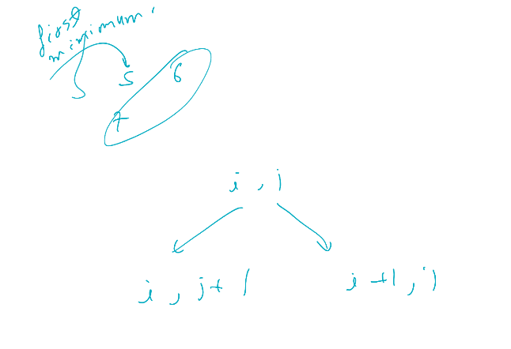

[Kth Smallest Element in a Sorted Matrix - LeetCode](https://leetcode.com/problems/kth-smallest-element-in-a-sorted-matrix/description/)



```cpp
int kthSmallest(vector<vector<int>>& ma, int k) {
    int n=ma.size();
    auto cmp=[&](auto &a, auto &b){
        int x=ma[a.first][a.second],y=ma[b.first][b.second];
        return x>y;
    };

    priority_queue<pair<int,int> ,vector<pair<int,int>>,decltype(cmp)> pq(cmp);

    pq.push({0,0});
    set<pair<int,int>> se; 
    se.insert({0,0});
    int ans=-1;
    while(k--){
        pair<int,int> p=pq.top();pq.pop();
        int i=p.first,j=p.second;
        ans=ma[i][j];
        if(j+1<n and se.count({i,j+1})==0){
            pq.push({i,j+1});
            se.insert({i,j+1});
        }
        
        if(i+1<n and se.count({i+1,j})==0){
            pq.push({i+1,j});
            se.insert({i+1,j});
        }
    }
    return ans;        
}
```
