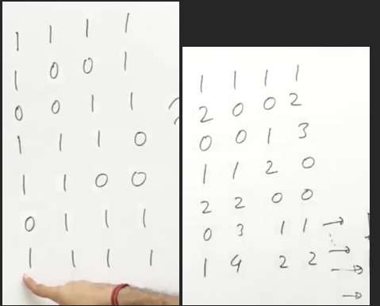

[](https://leetcode.com/problems/maximal-rectangle/)
1. Consider histogram problem with every row as the base one by one and seeing what is the largest rectangle which can be generated on this row
2. We have to convert into vectors of vector, where each vector will represent the hieght  of the histogram take that layer as the base

1. Generating the above said very efficiently



1. Traverse from top to bottom and keep adding till you get zero, when get zero, make the sum as 0

```cpp
//preprocessing the matrix 
for(int c=0;c<cc;c++){ 
    int sum=0; 
    for(int r=0;r<rr;r++){ 
        sum+=ma[r][c]; 
        if(ma[r][c]==0) sum=0; 
        ma[r][c]=sum; 
    } 
}
```

```cpp
//largestRectangleArea row wise 
int ans=0; 
for(int r=0;r<rr;r++){ 
    ans=max(ans,largestRectangleArea(ma[r])); 
} 
```

