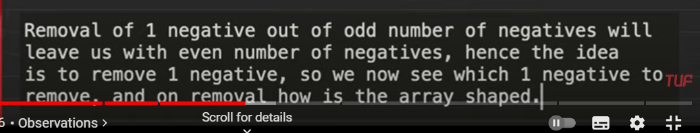
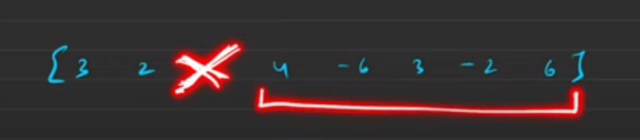
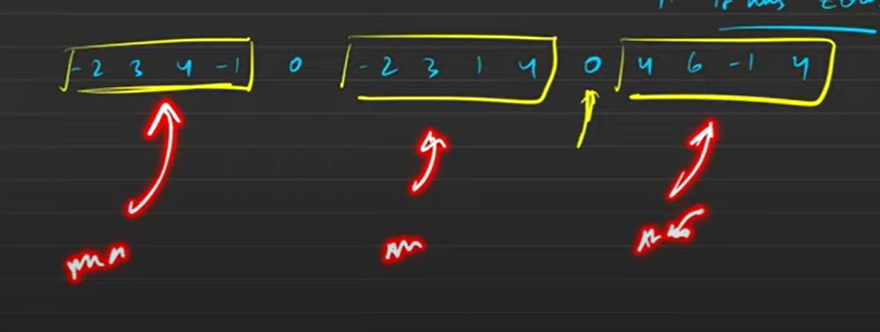

[Maximum Product Subarray - LeetCode](https://leetcode.com/problems/maximum-product-subarray/description/)

# Optmimal
if all positive elements, ans is product of all the elements

even negatives still

odd negatives


removing the elements, will break the subaray


The remaining thjing will be either a prefix or a suffix 


if it has any zero
 


# Optimal
```cpp
int f(vector<int>& v, int start, int end){
    if(start==end) return 0;
    int product=1,cnt=0;
    for(int i=start;i<end;i++){
        product*=v[i];
        if(v[i]<0) cnt++;
    }
    if(cnt%2==0) return product;
    int maxx=INT_MIN,pre=1,post=1;
    for(int i=start;i<end;i++){
        pre*=v[i];
        maxx=max(maxx,pre);
    }
    for(int i=end-1;i>=0;i--){
        post*=v[i];
        maxx=max(maxx,post);
    }        

    return maxx;
}


int maxProduct(vector<int>& v) {
    int maxx=INT_MIN;
    int n=v.size();
    int start=0;
    for(int i=0;i<n;i++){
        if(v[i]==0){
            maxx=max(maxx,f(v,start,i));
            start=i+1;
        }
    }
    maxx=max(maxx,f(v,start,n));
    return maxx;
}
```
[Maximum Product Subarray - Best Intuitive Approach Discussed - YouTube](https://youtu.be/hnswaLJvr6g?si=DWjPJXi1tYLQQw8N)

### Elegant solution
```cpp
int maxProduct(vector<int>& v) {
    int pre=1,post=1,ans=INT_MIN,n=v.size();
    for(int i=0;i<n;i++){
        if(pre==0) pre=1;
        if(post==0) post=1;
        pre*=v[i];
        post*=v[n-1-i];
        ans=max({ans,pre,post});
    }
    return ans;
}
```


# Brute force
```cpp
int maxProduct(vector<int>& v) {
    int maxx=INT_MIN;
    int n=v.size();
    for(int i=0;i<n;i++){
        int product=1;
        for(int j=i;j<n;j++){
            product*=v[j];
            maxx=max(product,maxx);
        }
    }
    return maxx;
}
```