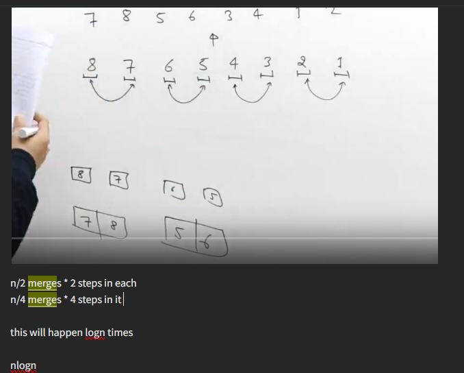

[](https://leetcode.com/problems/count-of-range-sum/solutions/3680067/c-merge-sort-segment-tree-bit/)
[](https://leetcode.com/problems/count-of-range-sum/solutions/3680067/c-merge-sort-segment-tree-bit/)

1. Doing the merge of the insetion sort effectively




[Merge Sort | Practice | GeeksforGeeks ](https://practice.geeksforgeeks.org/problems/merge-sort/1)
```cpp
void mergeSort(int v[], int l, int r){
    if(l==r) return;
    int m=(l+r)/2;
    mergeSort(v,l,m);
    mergeSort(v,m+1,r);
    merge(v,l,m,r);
}
```
1. Merging two sorted arrays using extra space, a problem exist where your goal is to merge two sorted arrays in constant space

```cpp
void merge(int v[], int l, int m, int r){
     int p1=l,p2=m+1;
     vector<int> temp;
     while(p1<=m and p2<=r){
         if(v[p1]<=v[p2]) temp.push_back(v[p1++]);
         else temp.push_back(v[p2++]);
     }
     while(p1<=m) temp.push_back(v[p1++]);
     while(p2<=r) temp.push_back(v[p2++]);
     for(int i=l;i<=r;i++){
         v[i]=temp[i-l];
     }
}
```

