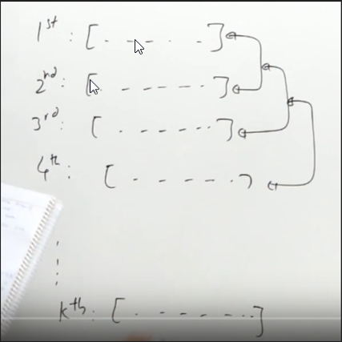
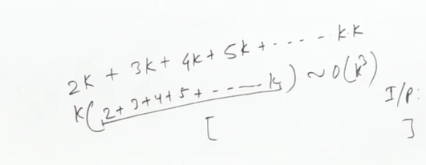

https://practice.geeksforgeeks.org/problems/merge-k-sorted-arrays/1







Brute force

better if had copied
n^2
Sorted
(n^2) log(n^2)

and we are not even using the fact that the arrays are already sorted


If we maintain k variable array and keep copying the minimum out of them

for two arrays we do it with two pointers

every time
this k variable will pass through all the n^2 elements and give us the answer

---
n^3

as n^2 times we have to find min in n time

isse badhiya to upar heen 

n^2 log(n^2)


by using pq
Instead of inserting the element in the priority queue, insert its indices(x,y) and infer the value easily, we desig pq such that we can fin minima optimally

n^2 * logn


# Method 1 by priority queue


```cpp
struct cmp{ 
    bool operator()(vector<int> &a, vector<int> &b){ 
        int x=gm[a[0]][a[1]],y=gm[b[0]][b[1]];
        return x>y;
    } 
};

int findKthSmallest(const vector<vector<int>> &ma, int k) {
  gm=ma;
  int result = 0;
  int rr=ma.size();
  vector<vector<int>> tmp;
  for(int r=0;r<rr;r++) tmp.push_back({r,0});
  priority_queue<vector<int> ,vector<vector<int>>,cmp> pq(tmp.begin(),tmp.end());

  while(!pq.empty()){
      auto vv=pq.top();pq.pop();
      int r=vv[0],c=vv[1];
      ans.push_back(ma[r][c]);
      if(c+1<ma[r].size()) pq.push({r,c+1});
    }

  return result;
};
```

# Method 2
nlogn * n

```cpp
vector<int> merge(vector<int>& v1, vector<int>& v2){
    int n1=v1.size();
    int n2=v2.size();
    vector<int> tmp;
    int i=0,j=0;
    while(i<n1 and j<n2){
        if(v1[i]<v2[j]) tmp.push_back(v1[i++]);
        else tmp.push_back(v2[j++]);
    }
    while(i<n1) tmp.push_back(v1[i++]);
    while(j<n2) tmp.push_back(v2[j++]);
    return tmp;
}


vector<int> f(vector<vector<int>> &ma, int l ,int h){
    if(l==h) return ma[l];
    int m=(l+h)/2;
    vector<int> v1=f(ma,l,m);
    vector<int> v2=f(ma,m+1,h);
    return merge(v1,v2);
}

public:
vector<int> mergeKArrays(vector<vector<int>> ma, int n){
    return f(ma,0,n-1);
}
```

/