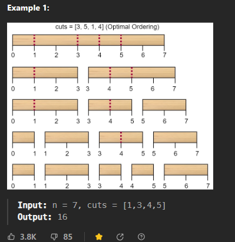
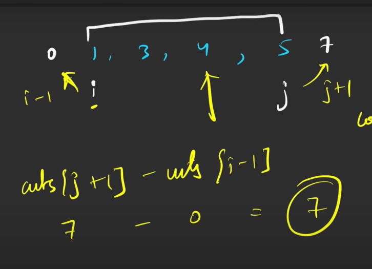
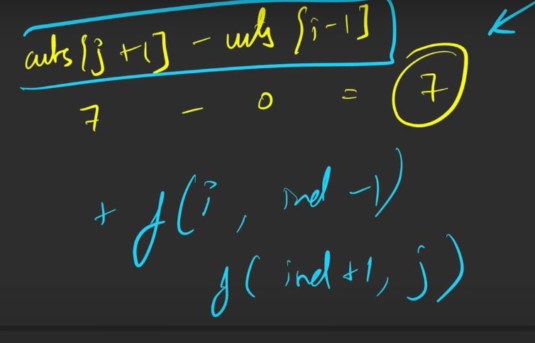

[leetcode.com](https://leetcode.com/problems/minimum-cost-to-cut-a-stick/description/)
1. The cost of one cut is the length of the stick to be cut


```cpp
sort(v.begin(),v.end());
v.insert(v.begin(),0);
v.push_back(len);
```




```cpp
int f(int i, int j, vector<int> &v){
  if(i>j) return 0;
  int minn=INT_MAX;
  for(int k=i;k<=j;k++){
      int cost=v[j+1]-v[i-1]+ f(i,k-1,v)+ f(k+1,j,v);
      minn= min(minn,cost); 
  }
  return minn;
    }
```

```cpp

int minCost(int len, vector<int>& v) {
    int n=v.size();
    sort(v.begin(),v.end());
    v.insert(v.begin(),0);
    v.push_back(len);
    //len become n+2
    //indices are between 0 to n+1
    return f(1,n,v);
}
```


