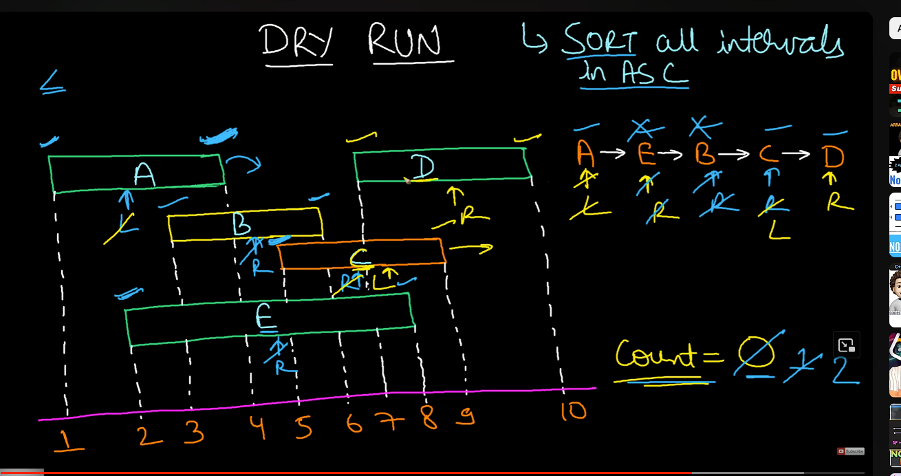

[leetcode.com](https://leetcode.com/problems/non-overlapping-intervals/description/)

------------------------------------------------------------------


```cpp
int eraseOverlapIntervals(vector<vector<int>>& ma) {
    int n=ma.size();
    sort(ma.begin(),ma.end());
    int i=0,ans=0;
    while(i<=n-2){
        if(ma[i][1]>ma[i+1][0]){
            ans++;
            ma[i+1][1]=min(ma[i][1],ma[i+1][1]);
        }
        i++;
    }
    return ans;
}
```


[Non-Overlapping Intervals - Leetcode 435 - Python - YouTube](https://youtu.be/nONCGxWoUfM?si=vKt35K5edzCNAuJJ)
--------------------------------------------


Total- no of intersecting intervals????
