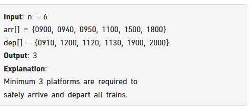
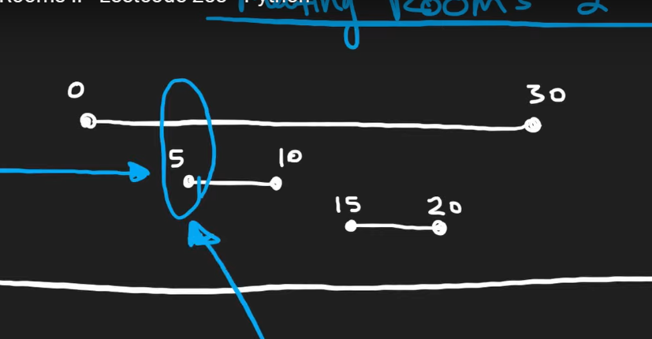
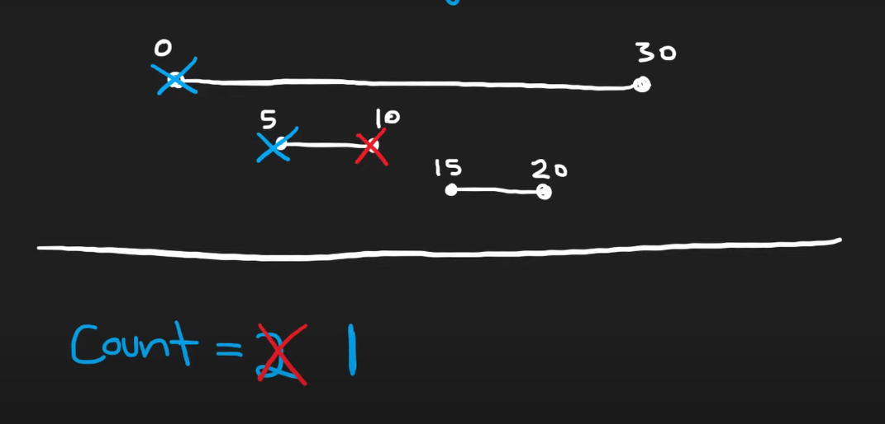

[Minimum Platforms | Practice | GeeksforGeeks ](https://practice.geeksforgeeks.org/problems/minimum-platforms-1587115620/1)

0000 to 2359


```cpp
int findPlatform(int arr[], int dep[], int n){
    vector<int> v(2460+5,0);
    for(int i=0;i<n;i++) v[arr[i]]++;
    for(int i=0;i<n;i++) v[dep[i]+1]--;
    for(int i=1;i<2460;i++) v[i]+=v[i-1];
    return *max_element(v.begin(),v.end());
}
```
[Meeting rooms | InterviewBit](https://www.interviewbit.com/problems/meeting-rooms/)


--------------------------------------------------------------------------------------------------

```cpp
int minMeetingRooms(vector<vector<int>>& ma) {
    priority_queue<vector<int>,vector<vector<int>>,greater<vector<int>>> pq;
    for(auto in: ma){
        pq.push({in[0],1});
        pq.push({in[1],-1});           
    }
    int ans=1,sum=0;
    while(!pq.empty()){
        int to=pq.top()[1];pq.pop();
        sum+=to;
        ans=max(ans,sum);
    }   
    return ans;
}
```

--------------------------------------------
# Also possible with sweep lines


# The below is extinct


\
[leetcode.com](https://leetcode.com/problems/meeting-rooms-ii/description/)

[youtu.be](https://youtu.be/FdzJmTCVyJU?si=jyvhDBzsmdp4JTJi)




Another meeting started before the ending of the first meeting




```cpp
int minMeetingRooms(vector<vector<int>>& intervals) {
    vector<int> s,e;
    int n=intervals.size();
    for(int i=0;i<n;i++){
        s.push_back(intervals[i][0]);
        e.push_back(intervals[i][1]);
    }
    sort(s.begin(),s.end());
    sort(e.begin(),e.end());
    int i=0,j=0;
    int ans=0;
    int cnt=0;
    while(i<n){
        if(s[i]<e[j]){
            i++;
            cnt++;
        }
        else{
            j++;
            cnt--;
        }
        ans=max(cnt,ans);
    }
    return ans;
}
```
