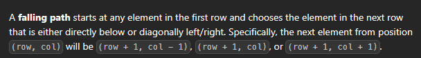

[Minimum Falling Path Sum - LeetCode](https://leetcode.com/problems/minimum-falling-path-sum/description/)



```cpp
int f(vector<vector<int>>& ma, int r, int c, int n){
    if(c>=n or c<0) return INT_MAX;
    if(r==0) return ma[r][c];
    return ma[r][c]+min({
            f(ma,r-1,c,n),
            f(ma,r-1,c+1,n),
            f(ma,r-1,c-1,n)
        });
}


int minFallingPathSum(vector<vector<int>>& ma) {
    int n=ma.size();
    int ans=INT_MAX;
    for(int i=0;i<n;i++){
        ans=min(ans,f(ma,n-1,i,n));
    }
    return ans;        
}
```

# 
```cpp
int minFallingPathSum(vector<vector<int>>& ma) {
    int n=ma.size();
    vector<vector<int>> dp(n,vector<int>(n));
    for(int i=0;i<n;i++) dp[0][i]=ma[0][i];
    for(int i=1;i<n;i++){
        for(int j=0;j<n;j++){
            int minn=ma[i-1][j];
            if(j-1>=0) minn=min(minn,ma[i-1][j-1]);
            if(j+1<n) minn=min(minn,ma[i-1][j+1]);
            ma[i][j]+=minn;
        }
    }
    return *min_element(ma[n-1].begin(),ma[n-1].end());        
}
```


```cpp
int f(vector<vector<int>>& ma, int r, int c, int n){
    if(c>=n or c<0) return INT_MAX;
    if(r==n-1) return ma[r][c];
    return ma[r][c]+min({
            f(ma,r+1,c,n),
            f(ma,r+1,c+1,n),
            f(ma,r+1,c-1,n)
        });
}


int minFallingPathSum(vector<vector<int>>& ma) {
    int n=ma.size();
    int ans=INT_MAX;
    for(int i=0;i<n;i++){
        ans=min(ans,f(ma,0,i,n));
    }
    return ans;        
}
```


