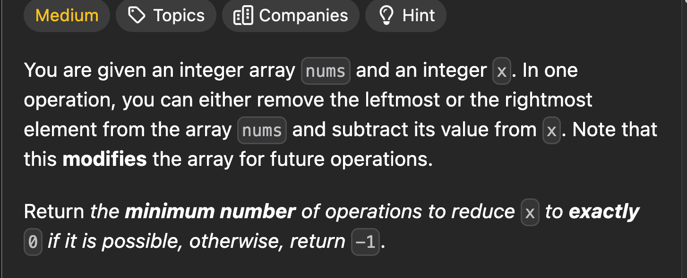
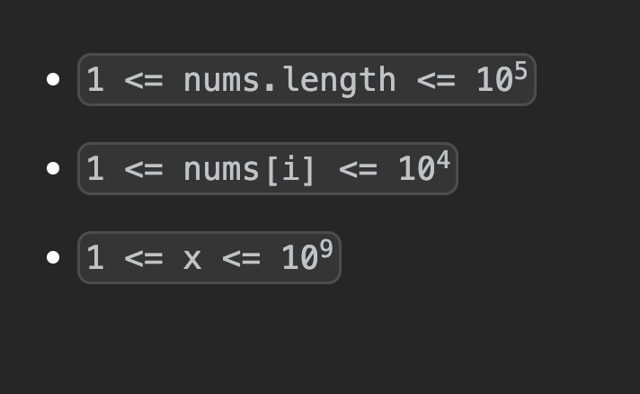

[Minimum Operations to Reduce X to Zero](https://leetcode.com/problems/minimum-operations-to-reduce-x-to-zero/)







```cpp
int f(vector<int> &v, int k) {
    int n=v.size();
    int l = 0, h = 0;
    long long sum = 0;
    int ans=0;

    while (h < n) {
        sum += v[h];
        if (sum == k) ans=max(ans,h-l+1);
        while (sum > k && l < h) {
            sum -= v[l];
            l++;
            if (sum == k) ans=max(ans,h-l+1);              
        }
        h++;
    }
    return ans;
}

int minOperations(vector<int>& v, int x) {
    int n=v.size();
    int sum=accumulate(v.begin(),v.end(),0);
    if(sum==x) return n;
    int res=f(v,sum-x);
    return res==0?-1:n-res;
}
```
