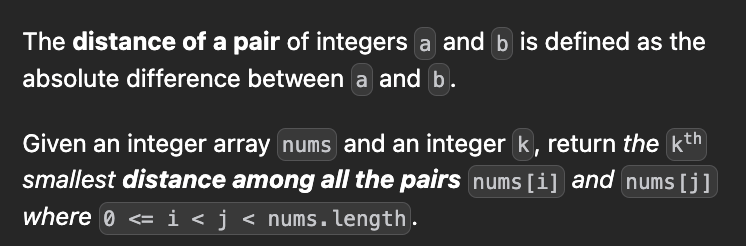

[719. Find K-th Smallest Pair Distance](https://leetcode.com/problems/find-k-th-smallest-pair-distance/)





```cpp
int f(int m, vector<int>& v, int n, int k){
    int l=0,h=1;
    int ans=0;
    while(h<n){
        if(abs(v[h]-v[l])<=m){
            ans+=h-l;
            h++;
        }
        else l++;
    }
    return ans>=k;
}

int smallestDistancePair(vector<int>& v, int k) {
    sort(v.begin(),v.end());
    int n=v.size();
    int l=INT_MAX;
    for(int i=1;i<n;i++){
        l=min(l,v[i]-v[i-1]);
    }
    int h=v[n-1]-v[0];
    int ans=-1;
    while(l<=h){
        int m=(l+h)/2;
        if(f(m,v,n,k)){
            ans=m;
            h=m-1;
        }
        else l=m+1;
    }
    return ans;
}
```