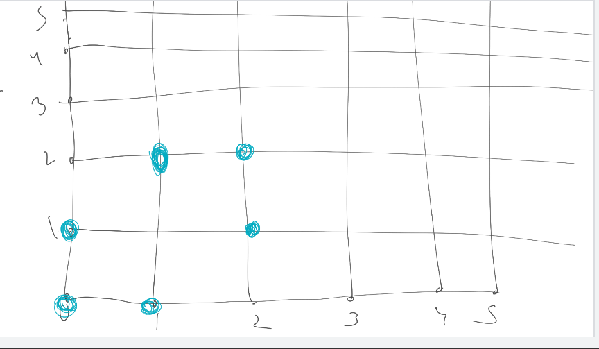
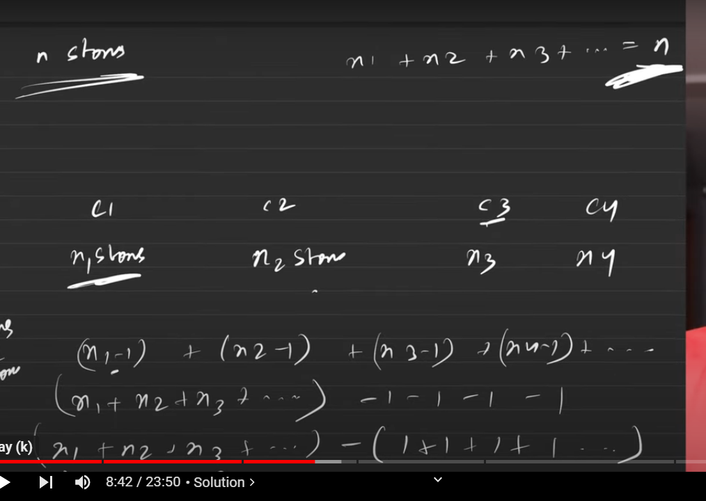

[leetcode.com](https://leetcode.com/problems/most-stones-removed-with-same-row-or-column/description/)



[youtu.be](https://youtu.be/OwMNX8SPavM)




n- no of components

```cpp
class Solution {
public:

    int removeStones(vector<vector<int>>& stones) {
        return stones.size()-f(stones);
    }
};
```