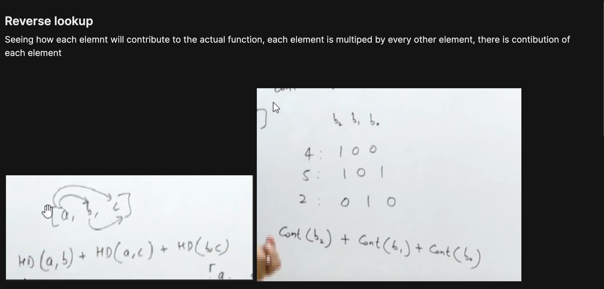
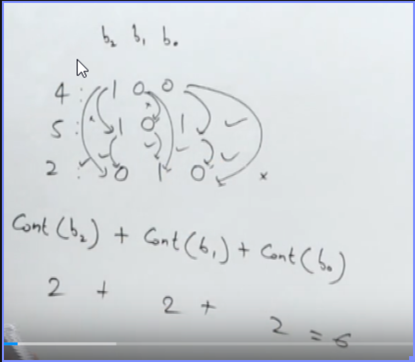
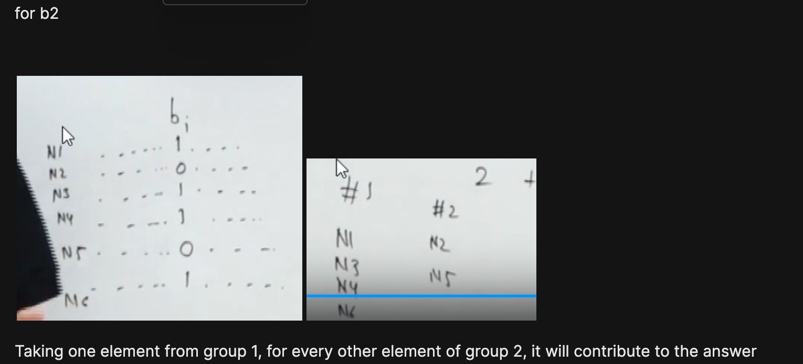

# ^
1. will be minimum of sorted and onsecutive
see prrof in ppa

2. Max by trie


# Sum of NC2 pairs of ^ ka popcount







```cpp
ll ans=0;
ll mask=1ll<<31;
while(mask){
  int cnt=0;
  for(int x v) if(x & mask) cnt++;
  ans+=cnt*(n-cnt);
  mask>>=1;
}
```
