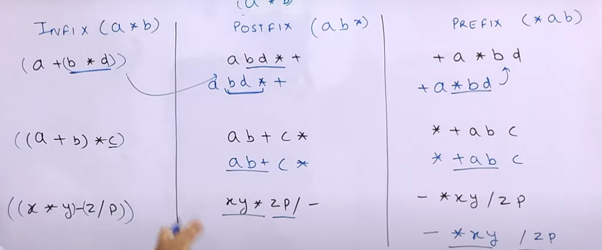

# Infix

normal wale

computer ko samajh nahi ata

if we have write a program it have to itrirate through the string like thing multiple times,finding the highest precedence everytime, performing one operation each time
Computer uses preceence to parenthesisie, not to calculate

[Infix to Postfix Conversion Using Stack | Infix Postfix and Prefix Expressions | DSA-One Course #46 - YouTube](https://youtu.be/_PU5t-gk_B4?si=rpItqM8m3OUqbk18)
