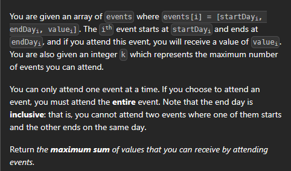

[leetcode.com](https://leetcode.com/problems/maximum-number-of-events-that-can-be-attended-ii/description/?envType=study-plan-v2&envId=dynamic-programming-grandmaster)



```cpp
class Solution {
public:
    int f(vector<vector<int>>& events, int idx, int k, int n){
        if(idx==n or k==0) return 0;
        int i;
        for(i=idx+1;i<n;i++){
            if(events[i][0]>events[idx][1]) break;
        }
        return max(f(events,idx+1,k,n),events[idx][2]+f(events,i,k-1,n));
    }


    int maxValue(vector<vector<int>>& events, int k) {
        sort(events.begin(),events.end());
        int n=events.size();
        return f(events, 0,k,n);
    }
};
```

```cpp
class Solution {
public:
    int f(vector<vector<int>>& events, int idx, int k, int n, vector<vector<int>> &dp){
        if(idx==n or k==0) return 0;
        if(dp[idx][k]!=-1) return dp[idx][k];
        int i;
        for(i=idx+1;i<n;i++)
        {
            if(events[i][0]>events[idx][1]) break;
        }
        return dp[idx][k]=max(f(events,idx+1,k,n,dp),events[idx][2]+f(events,i,k-1,n,dp));
    }


    int maxValue(vector<vector<int>>& events, int k) {
        sort(events.begin(),events.end());
        int n=events.size();
        vector<vector<int>> dp(n,vector<int>(k+1,-1));
        return f(events, 0,k,n,dp);
    }
};
```


# nlognk

```cpp
class Solution {
public:
    int f(vector<vector<int>>& events, int idx, int k, int n, vector<vector<int>> &dp){
        if(idx==n or k==0) return 0;
        if(dp[idx][k]!=-1) return dp[idx][k];
        vector<int> tmp={events[idx][1],INT_MAX,INT_MAX};
        int i=upper_bound(events.begin(),events.end(),tmp)-events.begin();
        return dp[idx][k]=max(f(events,idx+1,k,n,dp),events[idx][2]+f(events,i,k-1,n,dp));
    }


    int maxValue(vector<vector<int>>& events, int k) {
        sort(events.begin(),events.end());
        int n=events.size();
        vector<vector<int>> dp(n,vector<int>(k+1,-1));
        return f(events, 0,k,n,dp);
    }
};
```

