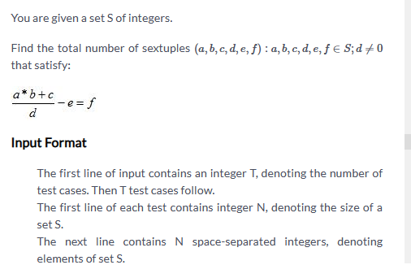

[Master Data Structures, Algorithms & System Design: Become 100% Coding Interview Ready](https://dashboard.programmingpathshala.com/renaissance/practice/question?questionId=136&sectionId=1&moduleId=2&topicId=7&subtopicId=90&assignmentId=20)





```cpp
void solve(){
    int n;
    cin>>n;
    vector<int> v(n);
    for(int i=0;i<n;i++) cin>>v[i];
    unordered_map<int,int> m;
    int cnt=0;
    for(int a:v){
      for(int b:v){
          for(int c:v){
            m[a*b+c]++;
          }
      }
    }
    
    for(int d:v){
        if(d==0) continue;
      for(int e:v){
        for(int f: v){
            cnt+=m[d*(e+f)];
        }    
      }
    }
    cout<<cnt<<'\n';

}
```


# Optimized


# Full code
```cpp
#include <bits/stdc++.h>
using namespace std;

void solve(){
    int n;
    cin>>n;
    vector<int> v(n);
    for(int i=0;i<n;i++) cin>>v[i];
    unordered_map<int,int> m;
    int cnt=0;
    for(int a:v){
      for(int b:v){
          for(int c:v){
            m[a*b+c]++;
          }
      }
    }
    
    for(int d:v){
        if(d==0) continue;
      for(int e:v){
        for(int f: v){
            cnt+=m[d*(e+f)];
        }    
      }
    }
    cout<<cnt<<'\n';

}


int main() {
    int ttt;
    // ttt=1;
    cin>>ttt;
    while(ttt--) solve();
    return 0;
}
```