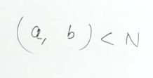
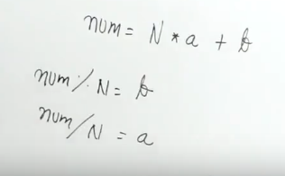
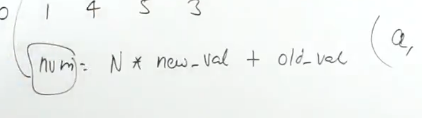
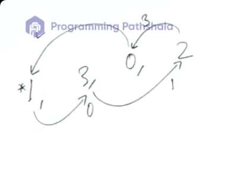
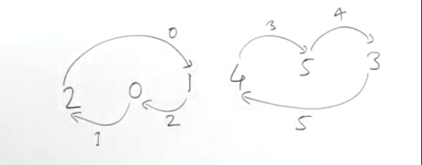
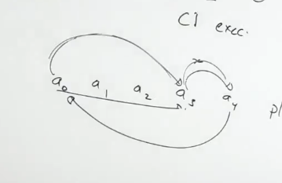

[Master Data Structures, Algorithms & System Design: Become 100% Coding Interview Ready](https://dashboard.programmingpathshala.com/renaissance/practice/question?questionId=20&sectionId=1&moduleId=1&topicId=1&subtopicId=14&assignmentId=3)


```
    // v[i]=j

    //in the transformed array
    // v[j]=i
        
    //v[v[i]]=i

```
```cpp
vector<int> tmp(n);
for(int i=0;i<n;i++){
    tmp[v[i]]=i;
}
```

Doing it in constant space


# Method 2
As the numbers are between 0 and n-1, we can do the following mapping

1. Placing such a number which represents both the old values and the new value









1. This beatufully works because whether a number is modified or not does not matter, % will always give the old value
2. If you had multiplued, then changed value will give you nice results, but unchanged value will give you zero

```cpp
vector<long long> v(n);
```

```
//v[v[i]]=i
```

```cpp
for(int i=0;i<n;i++){
    v[v[i]%n]  =(long long)n*i+v[v[i]%n];
}
```

```cpp
for(int i=0;i<n;i++) cout<<v[i]/n<<" ";
cout<<'\n';

```




more then one cycle can also be present



We dont want to touch a already touched cycle again

Cant maintain a bool array because it will again shoot the sc

1. Make the touched elements negative
2. But we have problems of the 0 element
4.  -(x+1) karo place
5. While extracting
6. -(x-1)

```cpp
for(int i=0;i<n;i++){
    if(v[i]>=0){
        int idx=v[i],val=i;
        while(idx!=i){
            int tmp=v[idx];
            v[idx]=-(val+1);
            val=idx;
            idx=tmp;
        }
        //you starting changing from i=idx=v[i]
        //you never changed first element of your cycle
        v[i]=-(val+1);
    }
}
```

```cpp
for(int i=0;i<n;i++) cout<<(-v[i]-1)<<" ";
```


