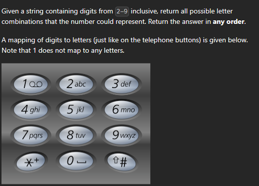

[Letter Combinations of a Phone Number - LeetCode](https://leetcode.com/problems/letter-combinations-of-a-phone-number/description/)




```cpp
void findAllCombs(string &s, string &tmp, int idx, vector<string> &ans, unordered_map<char,vector<char>> &digitMap){
    if(idx>=s.size()){
        ans.push_back(tmp);
        return;
    }
    for(int i=0;i<digitMap[s[idx]].size();i++){
        tmp+=digitMap[s[idx]][i];
        findAllCombs(s,tmp,idx+1,ans,digitMap);
        tmp.pop_back();
    } 

}

vector<string> letterCombinations(string s) {
    if(s.size()==0) return {};
    unordered_map<char,vector<char>> digitMap;
    digitMap['2']={'a','b','c'};
    digitMap['3']={'d','e','f'};
    digitMap['4']={'g','h','i'};
    digitMap['5']={'j','k','l'};
    digitMap['6']={'m','n','o'};
    digitMap['7']={'p','q','r','s'};
    digitMap['8']={'t','u','v'};
    digitMap['9']={'w','x','y','z'};

    vector<string> ans;
    string tmp;
    findAllCombs(s,tmp,0,ans,digitMap);
    return ans;
}
```
