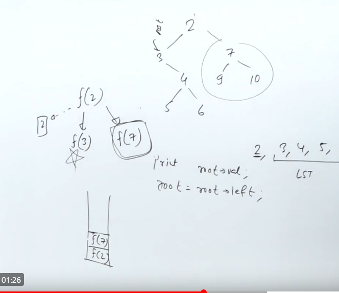
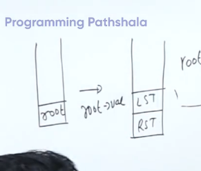
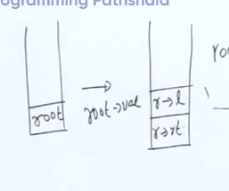
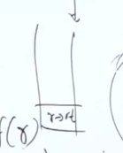
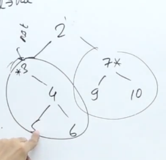
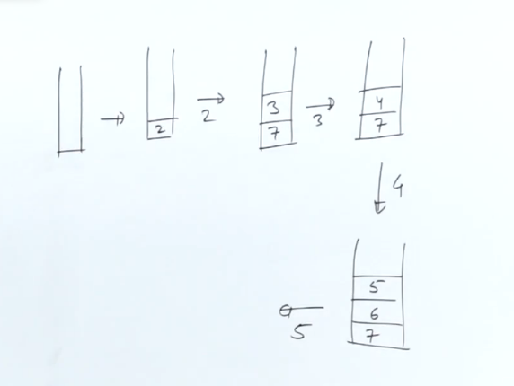

[Binary Tree Preorder Traversal - LeetCode](https://leetcode.com/problems/binary-tree-preorder-traversal/)


```cpp
vector<int> preorderTraversal(TreeNode* root) {
    stack<TreeNode*> st;
    vector<int> traversal;
    if(!root) return traversal;
    st.push(root);
    while(!st.empty()){
        TreeNode* node=st.top();
        st.pop();
        traversal.push_back(node->val);
        if(node->right) st.push(node->right);
        if(node->left) st.push(node->left);
    }
    return traversal;
}
```



Getting back to rst after you have got to lst







