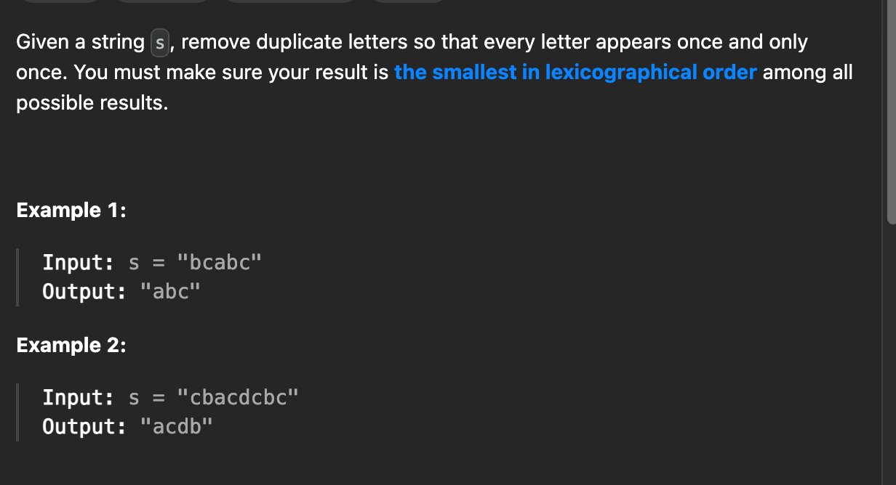
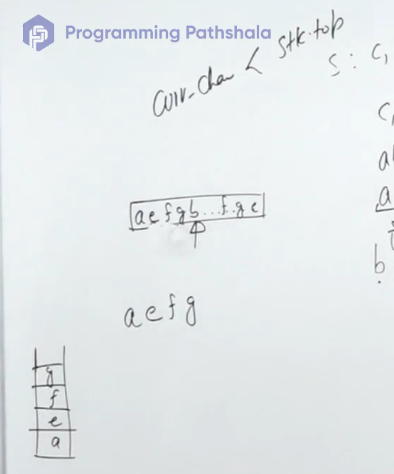
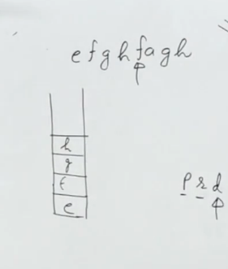
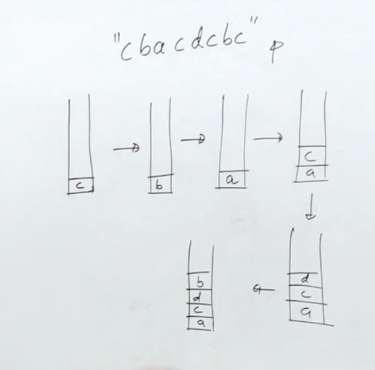

[ - YouTube](https://www.youtube.com/watch?v=ZOoobzPotwI)

[leetcode.com](https://leetcode.com/problems/remove-duplicate-letters/description/)






imp edge case





watch video

```cpp
string removeDuplicateLetters(string s) {
    unordered_map<char,int> freq;
    stack<char> st;
    for(char c: s) freq[c]++;
    unordered_map<char,bool> present;
    st.push(s[0]);
    freq[s[0]]--;
    present[s[0]]=1;
    int n=s.size();
    for(int i=1;i<n;i++){
        freq[s[i]]--;
        if(present[s[i]]) continue;
        while(!st.empty() and s[i]<st.top() and freq[st.top()]){
            present[st.top()]=0;
            st.pop();
        }
        st.push(s[i]);
        present[s[i]]=1;
    }
    string res;
    while(!st.empty()){
        res.push_back(st.top());
        st.pop();
    }
    reverse(res.begin(),res.end());
    return res;
}
```


