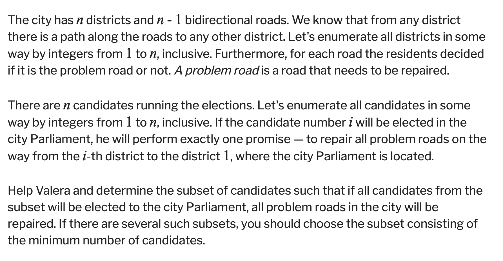
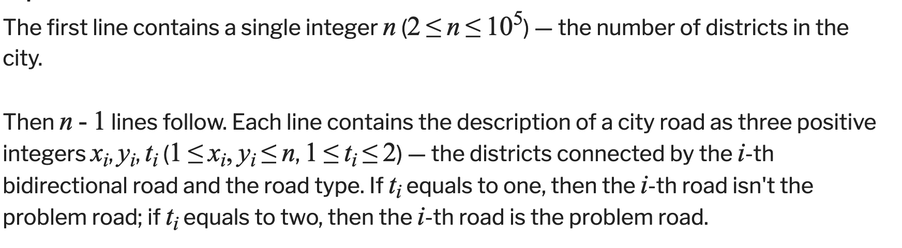
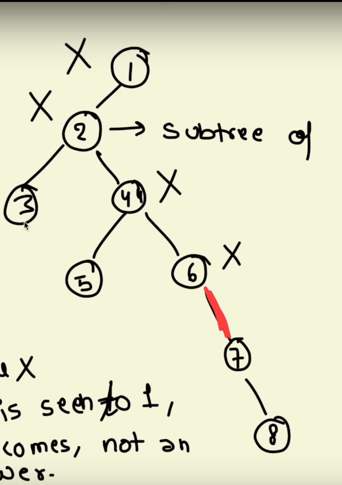
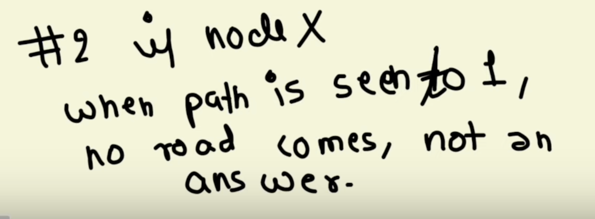
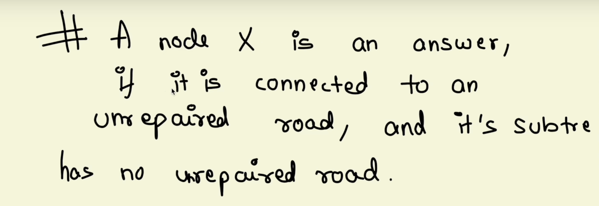
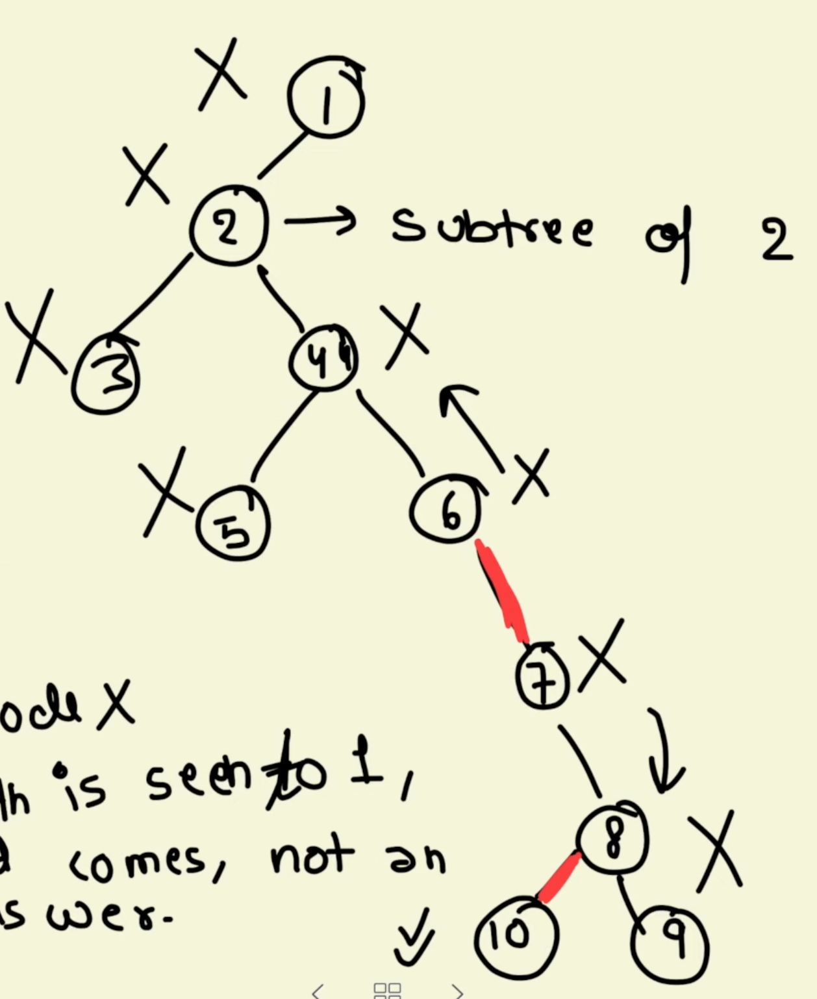
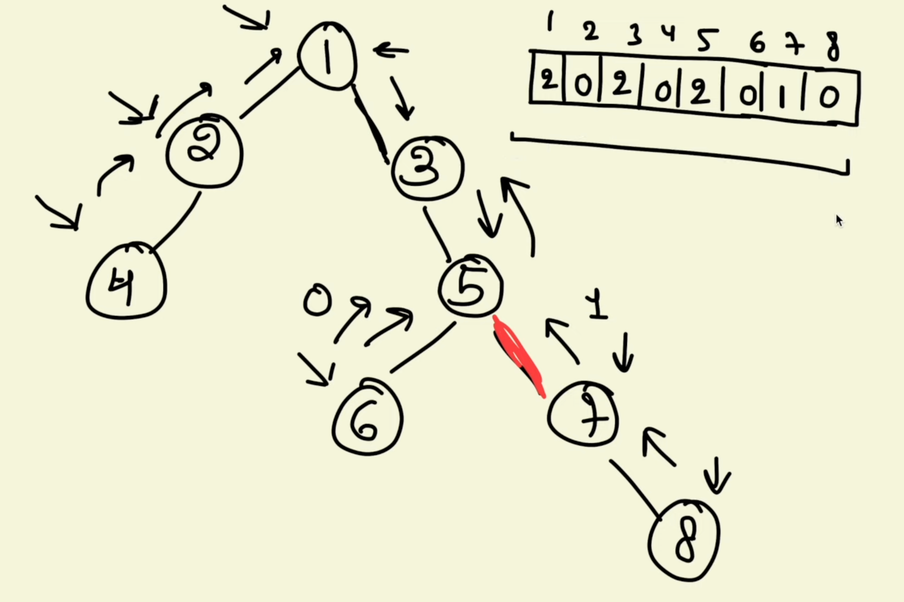
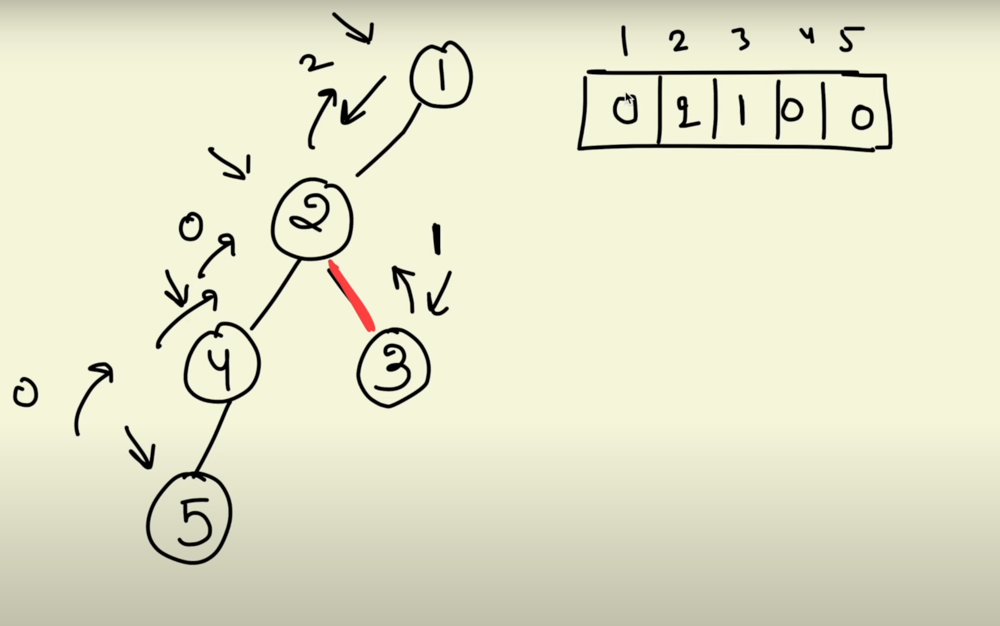

[Problem - 369C - Codeforces](https://codeforces.com/problemset/problem/369/C)

[Valera and Elections | Viraj - YouTube](https://www.youtube.com/watch?v=HLLaON3mx6M)
















# Final solution



# Solution
the subtree rooted at that idx contains how many damaged node






```cpp
ll dfs(ll node, ll par, vvl &al, vl &repair, vl&subtree){
    if(repair[node]) subtree[node]++;
    for(ll nei: al[node]){
        if(nei==par) continue;
        subtree[node]+=dfs(nei,node,al,repair,subtree);
    }
    return subtree[node];
}

void solve(){
    iinp(n);
    vvl al(n,vl());
    vl repair(n,0);
    for(ll i=1;i<n;i++){
        ll u,v;
        inp(u,v);
        u--,v--;
        al[u].push_back(v);
        al[v].push_back(u);
        iinp(re);
        if(re==2){
            repair[v]=repair[u]=1;
        }
    }
    vl subtree(n,0);
    dfs(0,-1,al,repair,subtree);
    vl ans;
    for(ll i=0;i<n;i++){
        if(subtree[i]==1){
            ans.push_back(i+1);
        }
    }
    pri(ans.size());
    priv(ans);
    
}
```
