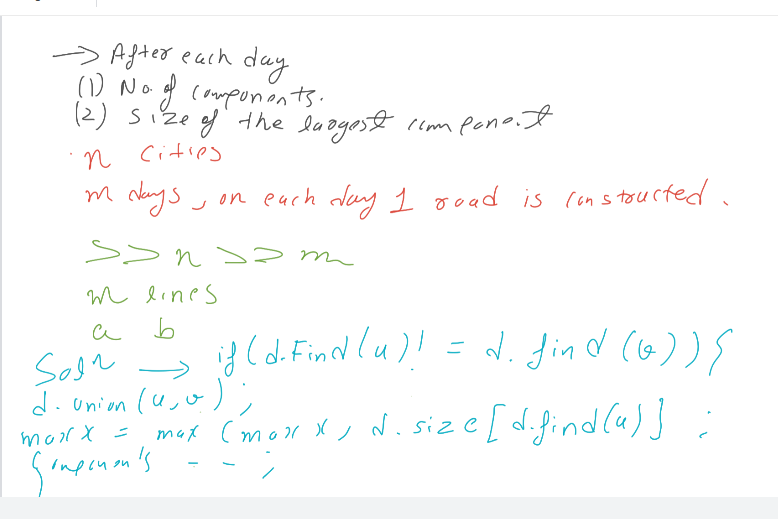

[CSES - Road Construction](https://cses.fi/problemset/task/1676/)


```cpp
void solve() {
    iinp(n);
    dsu d(n);
    iinp(m);
    ll components=n,maxx=1;
    for(ll i=0;i<m;i++){
        ll u,v;
        inp(u,v);
        u--,v--;
        if(d.findRoot(u)!=d.findRoot(v)){
            d.union_(u,v);
            maxx=max(maxx,d.size[d.findRoot(u)]);
            components--;
        }
        pri(components,maxx);
    }
    
}
```
