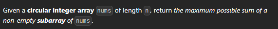

[Maximum Sum Circular Subarray - LeetCode](https://leetcode.com/problems/maximum-sum-circular-subarray/)



1. find miniumum subarray sum
2. subtract it from the array sum
3. edge case when all elements are negativer => Actually gives the right answer when no element is taken but we have to take at least element

```cpp
int maxSubarraySumCircular(vector<int>& v) {
    int ans1=maxSubArray(v);
    if(accumulate(v.begin(),v.end(),0)==minSubArray(v)) return ans1;
    int ans2=accumulate(v.begin(),v.end(),0)-minSubArray(v);
    return max(ans1,ans2);
}
```

# Solution involving prefix sum and suffix sum which I cant understand
```cpp
int maxSubArray(vector<int>& v) {
    int n=v.size(),curr_sum=0,ans=INT_MIN;
    for(int x: v)
    {
        curr_sum+=x;
        if(curr_sum>ans)
        {
            ans=curr_sum;
        }
        if(curr_sum<0)
        {
            curr_sum=0;
        }
    }
    return ans;
}


int maxSubarraySumCircular(vector<int>& v) {
    int n=v.size();
    //normal kadane
    int ans1=maxSubArray(v);
    vector<int> ps(n),ss(n);
    ps[0]=v[0];
    ss[n-1]=v[n-1];
    for(int i=1;i<n;i++){
        ps[i]=v[i]+ps[i-1];
        ss[n-i-1]=v[n-1-i]+ss[n-i];
    }
    //max value of ss for each index
    vector<int> max_ss(n);
    max_ss[n-1]=ss[n-1];
    for(int i=n-2;i>=0;i--){
        max_ss[i]=max(ss[i],max_ss[i+1]);
    } 
    int ans2=INT_MIN;
    for(int i=0;i<=n-2;i++){
        ans2=max(ans2,ps[i]+max_ss[i+1]);
    } 
    return max(ans1,ans2);
}
```


# Trying with copying array once
```cpp
class Solution {
public:
    int maxSubArray(vector<int>& v) {
        int n=v.size()/2,curr_sum=0,ans=INT_MIN,cnt=0;
        for(int x: v){
            cnt++;
            if(cnt>n){
                cnt=0;
                continue;
            }
            curr_sum+=x;
            if(curr_sum>ans){
                ans=curr_sum;
            }
            if(curr_sum<0){
                curr_sum=0;
                cnt=0;
            }
        }
        return ans;
    }

    int maxSubarraySumCircular(vector<int>& v) {
        int n=v.size();
        for(int i=0;i<n;i++) v.push_back(v[i]);
        return maxSubArray(v);
    }
};
```
