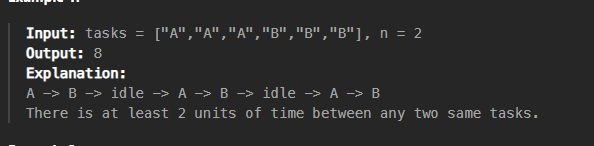

[Task Scheduler - LeetCode](https://leetcode.com/problems/task-scheduler/description/)

 => every window of size n+1 should have unique char
 => the greed is first doing the activities with the highest frequency

```cpp
int leastInterval(vector<char>& v, int n) {
    unordered_map<char,int> cnt;
    for(char c:v) cnt[c]++;
    priority_queue<int> pq;
    for(auto p:cnt) pq.push(p.second);
    int req_len=n+1;
    int ans=0;
    while(!pq.empty()){
        //VERY BEAUTIFULL TECHNIQUE IS IMPLEMENTED BY USING THIS ARRAY
        vector<int> tmp;
        int curr_len=0;
        while(curr_len!=req_len){
            if(pq.empty()){
                //the current itiration is finished
                if(!tmp.empty()) ans+=(req_len-curr_len); 
                //if more itirations are remaining, then pad the current interval with nulls
                break;
            }
            int x=pq.top();
            pq.pop();
            if(x-1>0) tmp.push_back(x-1);
            ans++; 
            curr_len++;
        }
        for(int y:tmp) pq.push(y);
    }
    return ans;
}
```
  