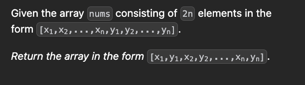
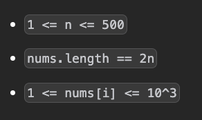
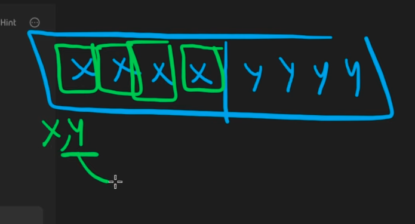
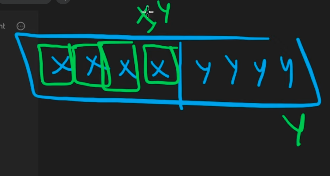

```cpp
vector<int> shuffle(vector<int>& v, int n) {
    for(int i=0;i<n;i++){
        v[i]<<=10;
        v[i]|=v[i+n];
    }
    int j=2*n-1;
    for(int i=n-1;i>=0;i--){
        int mask=(1<<10)-1;
        int y=v[i]&mask;
        int x=v[i]>>=10;
        v[j]=y;
        v[j-1]=x;
        j-=2;
    }
    return v;
}
```
