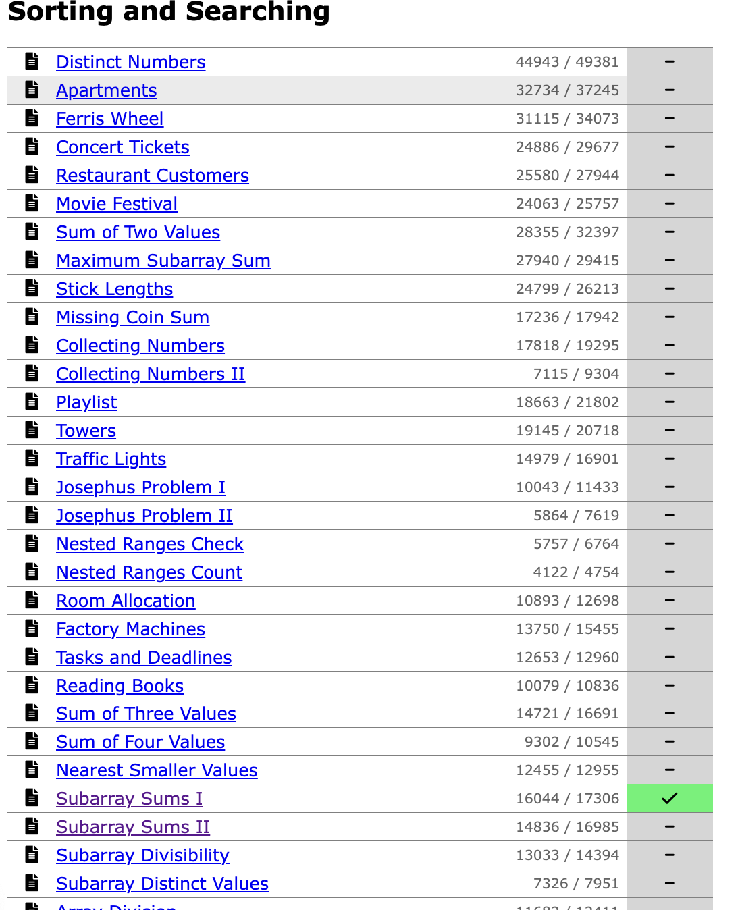

Quick sort and partition logic
sorting types by leetcode

troub;e sort

[404 Page not found](https://codingcompetitions.withgoogle.com/codejam/round/00000000000000cb/00000000000079cb)

[Problem - B - Codeforces](https://codeforces.com/contest/659/problem/B)
https://www.spoj.com/problems/ADAUSORT/
https://codeforces.com/contest/659/problem/B)

[https://www.codechef.com/problems/MAXDIFF](https://www.codechef.com/problems/MAXDIFF)

[https://www.spoj.com/problems/ABCDEF/](https://www.spoj.com/problems/ABCDEF/)

[https://codeforces.com/contest/580/problem/B](https://codeforces.com/contest/580/problem/B)

[https://codeforces.com/contest/895/problem/B](https://codeforces.com/contest/895/problem/B)

[https://codeforces.com/contest/231/problem/C](https://codeforces.com/contest/231/problem/C)

12

[https://www.codechef.com/MARCH18B/problems/MINVOTE](https://www.codechef.com/MARCH18B/problems/MINVOTE)

[https://codeforces.com/contest/1174/problem/B](https://codeforces.com/contest/1174/problem/B)

[https://codeforces.com/contest/81/problem/C](https://codeforces.com/contest/81/problem/C)

[https://codeforces.com/contest/816/problem/B](https://codeforces.com/contest/816/problem/B)

[https://codeforces.com/contest/276/problem/C](https://codeforces.com/contest/276/problem/C)

[https://codeforces.com/contest/296/problem/C](https://codeforces.com/contest/296/problem/C)

