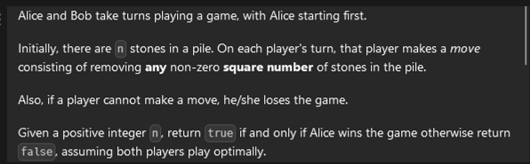

[leetcode.com](https://leetcode.com/problems/stone-game-iv/description/)



```cpp
bool f(int x){
    if(x<=0) return 0;
    for(int i=1;i*i<=x;i++){
        if(winnerSquareGame(x-i*i)==0) return 1;
    }
    return 0;
}

bool winnerSquareGame(int n) {
    return f(n);
}
```
