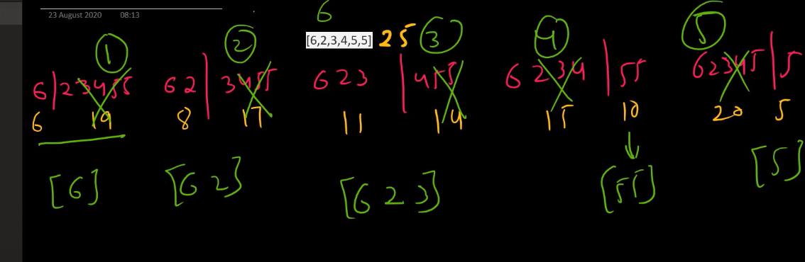
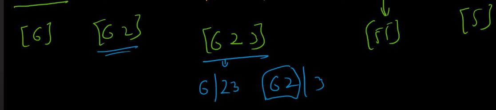

[Stone Game V - LeetCode](https://leetcode.com/problems/stone-game-v/description/)
[Leetcode 1563. Stone Game V - YouTube](https://youtu.be/ysmpcUCW0sM?si=PSiGQz-ODIuOKchn)
```
//alice divides the row into two non-empty rows=> l and r
//bob calculates the sum of each
//bob throws away the side having maximum sum so alice score by as low as possible
//alice score increase by remaining
//if l==r
//alice throws away any of the side
//end when noOfStones==1
//maximum score gain by Alice
```


# Rzepeated sub problems


```cpp
int f(int s, int e, vector<int> &v){
    if(s>=e) return 0;
    int sumOfArr=accumulate(v.begin()+s,v.begin()+e+1,0);
    int l=0,r=sumOfArr;
    int ans=0;
    for(int i=s;i<=e;i++){
        l+=v[i];
        r-=v[i];
        if(l<r) ans=max(ans,l+f(s,i,v));
        if(l==r) ans=max(ans,l+max(f(s,i,v),f(i+1,e,v)));
        if(l>r) ans=max(ans,r+f(i+1,e,v));
    }
    return ans;
}   


int stoneGameV(vector<int>& v) {
    int n=v.size();
    return f(0,n-1,v);
}
```


```cpp
class Solution {
public:
    int f(int s, int e, vector<int> &v, vector<vector<int>> &mem){
        if(s>=e) return 0;
        if(mem[s][e]!=-1) return mem[s][e];
        int sumOfArr=accumulate(v.begin()+s,v.begin()+e+1,0);
        int l=0,r=sumOfArr;
        int ans=0;
        for(int i=s;i<=e;i++){
            l+=v[i];
            r-=v[i];
            if(l<r) ans=max(ans,l+f(s,i,v,mem));
            if(l==r) ans=max(ans,l+max(f(s,i,v,mem),f(i+1,e,v,mem)));
            if(l>r) ans=max(ans,r+f(i+1,e,v,mem));
        }
        return mem[s][e]=ans;
    }   


    int stoneGameV(vector<int>& v) {
        int n=v.size();
        vector<vector<int>> mem(n,vector<int>(n,-1));
        return f(0,n-1,v,mem);
    }
};
```
