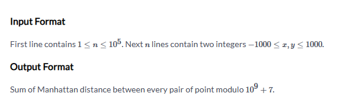
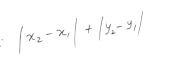
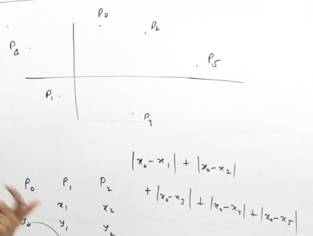
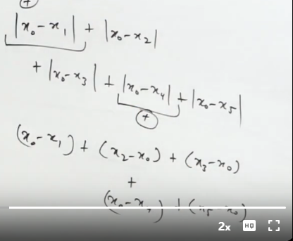
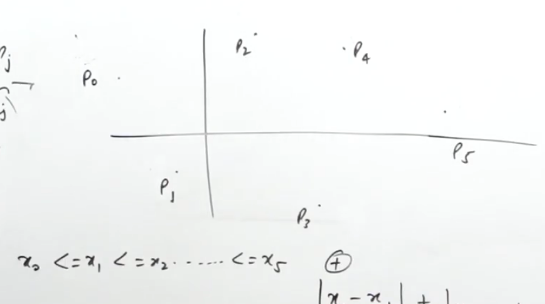
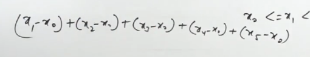
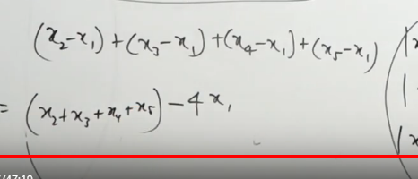
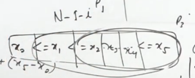
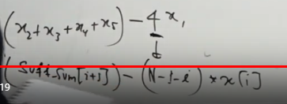

[Master Data Structures, Algorithms & System Design: Become 100% Coding Interview Ready](https://dashboard.programmingpathshala.com/renaissance/practice/question?questionId=135&sectionId=1&moduleId=2&topicId=7&subtopicId=90&assignmentId=20)







X and Y can be independent

1. How will these modulus open











for p0


for p1







```cpp
int f(vector<int> &v){
    sort(v.begin(),v.end());
    int n=v.size();
    vector<int> ss(n);
    ss[n-1]=v[n-1];
    for(int i=n-2;i>=0;i--) ss[i]=ss[i+1]+v[i];
    int ans=0;
    for(int i=0;i<=n-2;i++) ans=moda(ans,moda(ss[i+1],-(n-i-1)*v[i]));
    return ans;
}

void solve(){
    int n;
    cin>>n;
    vector<int> x(n),y(n);
    for(int i=0;i<n;i++){
        cin>>x[i]>>y[i];  
    } 
    int ans=moda(f(x),f(y));
    cout<<ans<<'\n';
}

```
# without the suffix sum array

```cpp
int f(vector<int> &v){
    sort(v.begin(),v.end());
    int n=v.size();
    int sum=accumulate(v.begin(),v.end(),0);

    int ans=0;
    for(int i=0;i<=n-2;i++){
        sum-=v[i];
        ans=moda(ans,moda(sum,-(n-i-1)*v[i]));
    } 
    return ans;
}

void solve(){
    int n;
    cin>>n;
    vector<int> x(n),y(n);
    for(int i=0;i<n;i++){
        cin>>x[i]>>y[i];  
    } 
    int ans=moda(f(x),f(y));
    cout<<ans<<'\n';
}
```


# Full code
```cpp
#include <bits/stdc++.h>
using namespace std;
#define ll int
#define mod 1000000007  
ll moda(ll a, ll b, ll cm=mod) {a = a % cm; b = b % cm; return (((a + b) % cm) + cm) % cm;}


int f(vector<int> &v){
    sort(v.begin(),v.end());
    int n=v.size();
    vector<int> ss(n);
    ss[n-1]=v[n-1];
    for(int i=n-2;i>=0;i--) ss[i]=ss[i+1]+v[i];
    int ans=0;
    for(int i=0;i<=n-2;i++) ans=moda(ans,moda(ss[i+1],-(n-i-1)*v[i]));
    return ans;
}

void solve(){
    int n;
    cin>>n;
    vector<int> x(n),y(n);
    for(int i=0;i<n;i++){
        cin>>x[i]>>y[i];  
    } 
    int ans=moda(f(x),f(y));
    cout<<ans<<'\n';
}


int main() {
    int ttt;
    ttt=1;
    // cin>>ttt;
    while(ttt--) solve();
    return 0;
}
```
