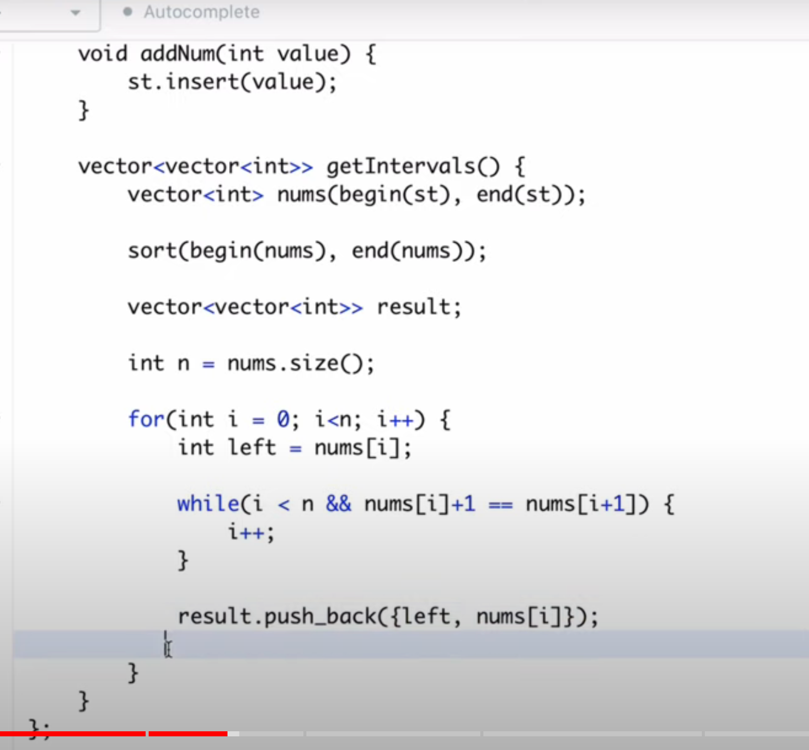

[Data Stream as Disjoint Intervals - LeetCode](https://leetcode.com/problems/data-stream-as-disjoint-intervals/description/)

---------



-----


----------------


```cpp
class SummaryRanges {
    set<int> se;
public:
    SummaryRanges() {
        
    }
    
    void addNum(int value) {
        se.insert(value);
    }
    
    vector<vector<int>> getIntervals() {
        if(se.empty()) return {};
        vector<vector<int>> ans;
        int left = -1, right = -1;
        for (int x : se) {
            if(left < 0) left = right = x;
            else if(x == right + 1) right = x;
            else{
                ans.push_back({left, right});
                left = right = x;
            }
        }
        ans.push_back({left, right});

        return ans;
    }
};
```
