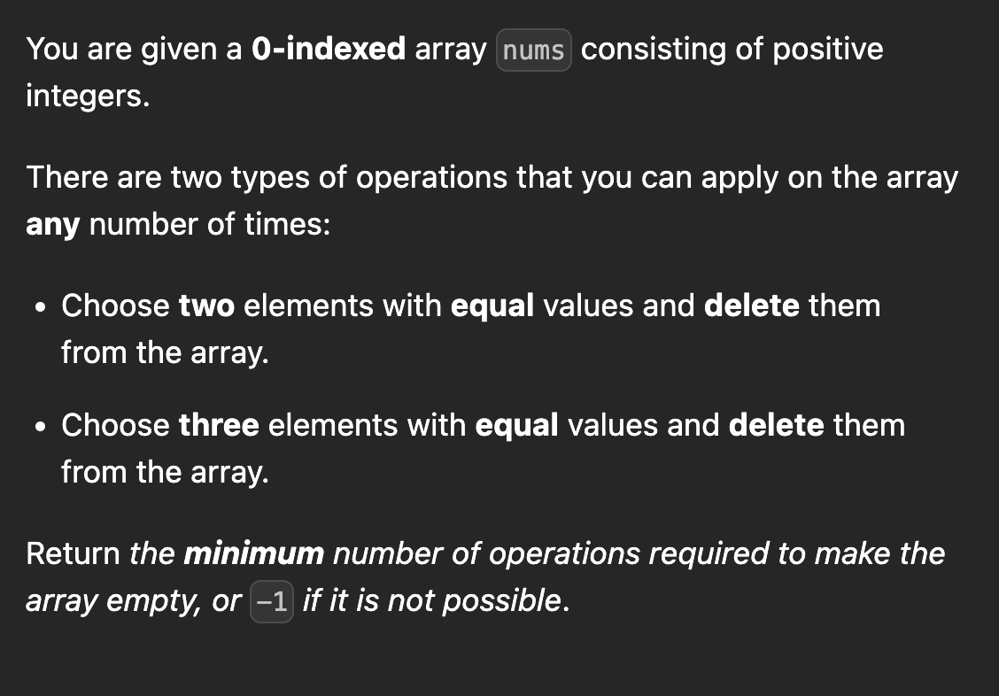

[Minimum Number of Operations to Make Array Empty - LeetCode](https://leetcode.com/problems/minimum-number-of-operations-to-make-array-empty/description/?envType=daily-question&envId=2024-01-04)



```cpp
int f(int n){
    int ans=n/3;
    int tmp=n%3;
    switch(tmp){
        case 0:
        break;
        case 1:
        ans=(n-1)/3+1;
        break;
        case 2:
        ans++;
    }
    return ans;
}

int minOperations(vector<int>& nums) {
    unordered_map<int,int> m;
    for(int x:nums) m[x]++;
    vector<int> v;
    for(auto p: m) v.push_back(p.second);
    int ans=0;
    for(int x: v){
        if(x==1) return -1;
        ans+=f(x);
    }
    return ans;
}
```


```cpp
vector<int> mem;

int ff(int k, vector<int> &v){
    if(k==0) return 0;
    if(k<0) return INT_MAX;
    if(mem[k]!=-1) return mem[k];
    int minn=INT_MAX;
    for(int x: v) minn=min(minn,ff(k-x,v));
    if(minn==INT_MAX) return INT_MAX;
    return mem[k]=1+minn;
}

int f(int k){
    mem= vector<int> (k+1,-1);
    vector<int> v={2,3};
    return ff(k,v);
}

int minOperations(vector<int>& nums) {
    unordered_map<int,int> m;
    for(int x:nums) m[x]++;
    vector<int> v;
    for(auto p: m) v.push_back(p.second);
    int ans=0;
    for(int x: v){
        int tmp=f(x);
        if(tmp==INT_MAX) return -1;
        ans+=tmp;
    }
    return ans;
}
```
